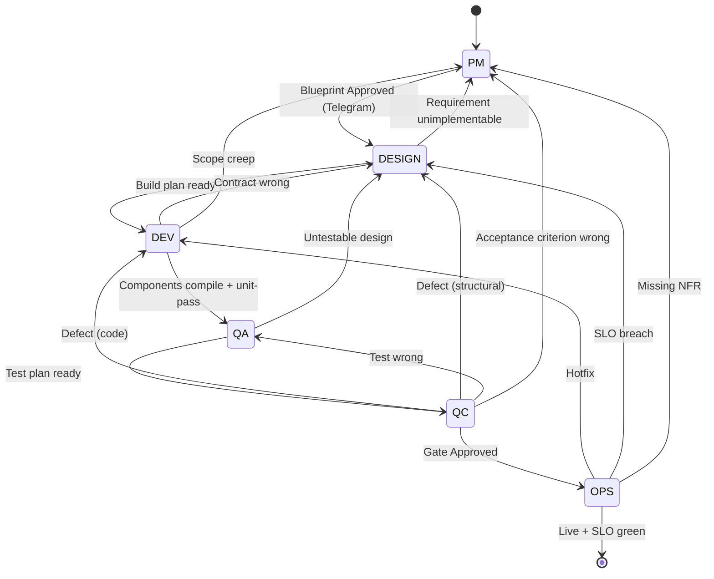

# GateForge — OpenClaw Agentic SDLC Guideline

> **One repo. Two topologies. One methodology.**
>
> The single source of truth for the GateForge Agentic SDLC pipeline — methodology, role guides, and OpenClaw runtime contracts for both the multi-agent and single-agent variants.

[](./VERSION) [](./LICENSE) [](#release-status) [](./CONTRIBUTING.md#branching-model) [](./CONTRIBUTING.md#versioning)

---

## What Is GateForge

GateForge is an **OpenClaw-based Agentic SDLC pipeline**. It uses one or more AI agents — each running on its own OpenClaw instance — to walk a project from requirements to production deployment under industry-standard methodology (IEEE 830, ISO 25010, C4, OWASP, IEEE 829, ISTQB, SRE, ITIL, SemVer).

GateForge agents are **not** chatbots producing free-form output. Every phase has a written guideline, a phase-exit checklist, and a quality gate. **The methodology is the value; the topology is an implementation choice.**

```
                                ┌────────────────────────────┐
                                │  GateForge Methodology     │
                                │  (Class B — guideline/)    │
                                │                            │
                                │  • Blueprint standards     │
                                │  • Role guides per phase   │
                                │  • Industry standards      │
                                └──────────────┬─────────────┘
                                               │
                              ┌────────────────┴────────────────┐
                              │                                 │
                              ▼                                 ▼
                ┌───────────────────────────┐    ┌───────────────────────────┐
                │  Multi-Agent Variant      │    │  Single-Agent Variant     │
                │  (Class A — variants/     │    │  (Class A — variants/     │
                │   multi-agent/)           │    │   single-agent/)          │
                │                           │    │                           │
                │  5 OpenClaw VMs           │    │  1 OpenClaw VM            │
                │  Hub + 4 spokes           │    │  Role-switching agent     │
                │  HTTPS + HMAC dispatch    │    │  In-process state machine │
                └───────────────────────────┘    └───────────────────────────┘
                              │                                 │
                              └────────────────┬────────────────┘
                                               │
                                               ▼
                              ┌───────────────────────────────┐
                              │  Per-Project Class C File     │
                              │  project/gateforge_<name>.md  │
                              │                               │
                              │  Lives in each project repo,  │
                              │  not here. Captures domain    │
                              │  glossary, stack deviations,  │
                              │  compliance overrides, etc.   │
                              └───────────────────────────────┘
```

---

## Variant Comparison — Pick One

|                              | **Multi-Agent**                            | **Single-Agent**                              |
|------------------------------|--------------------------------------------|-----------------------------------------------|
| **VMs**                      | 5 (Architect, Designer, Devs, QC, Operator)| 1                                             |
| **OpenClaw instances**       | 5                                          | 1                                             |
| **Models**                   | Opus 4.6 + Sonnet 4.6 + MiniMax 2.7        | Sonnet 4.6 (default — single model)           |
| **Inter-agent comms**        | Hub-and-spoke HTTPS + HMAC notifications   | None — internal phase transitions             |
| **Telegram operator gate**   | Architect (VM-1) only                      | The single agent                              |
| **Blueprint writes**         | Architect only (peer-gated)                | The single agent (self-gated)                 |
| **Quality gates**            | Cross-agent peer review                    | Self-review + Telegram-approved boundary      |
| **Setup time**               | ~60 min                                    | ~5 min (manual copy)                          |
| **Best for**                 | Multi-team, parallel work, audit-heavy     | Solo / small-team, prototypes, internal tools |
| **Folder**                   | [`variants/multi-agent/`](variants/multi-agent/) | [`variants/single-agent/`](variants/single-agent/) |

Both variants read **the same** methodology from [`guideline/`](guideline/). When the methodology is upgraded, both variants benefit immediately — no merge, no fork.

---

## Repository Layout

```
gateforge-openclaw-guideline/
│
├── README.md                               # This file
├── CONTRIBUTING.md                         # Authoring rules + Class A/B/C policy
├── CHANGELOG.md                            # SemVer history
├── VERSION                                 # Current SemVer
├── LICENSE
│
├── guideline/                              ┐
│   ├── BLUEPRINT-GUIDE.md                  │
│   ├── roles/                              │
│   │   ├── pm/PM-GUIDE.md                  │
│   │   ├── system-design/                  │  ← Class B — METHODOLOGY
│   │   │   ├── SYSTEM-DESIGN-GUIDE.md      │     (variant-agnostic, shared)
│   │   │   └── RESILIENCE-SECURITY-GUIDE.md│
│   │   ├── development/DEVELOPMENT-GUIDE.md│
│   │   ├── qa/QA-FRAMEWORK.md              │
│   │   ├── qc/QC-GUIDE.md                  │
│   │   └── operations/                     │
│   │       └── MONITORING-OPERATIONS-GUIDE.md
│   └── adaptation/                         │
│       ├── MULTI-AGENT-ADAPTATION.md       │
│       └── SINGLE-AGENT-ADAPTATION.md      ┘
│
├── variants/                               ┐
│   ├── multi-agent/                        │
│   │   ├── README.md                       │
│   │   ├── vm-1-architect/                 │
│   │   │   ├── SOUL.md                     │
│   │   │   ├── AGENTS.md                   │  ← Class A — RUNTIME CONTRACT
│   │   │   ├── USER.md                     │     (variant-specific, not shared)
│   │   │   ├── TOOLS.md                    │
│   │   │   └── openclaw-config/            │
│   │   ├── vm-2-designer/  …               │
│   │   ├── vm-3-developers/ …              │
│   │   ├── vm-4-qc-agents/ …               │
│   │   ├── vm-5-operator/  …               │
│   │   ├── install/                        │
│   │   └── docs/                           │
│   │                                       │
│   └── single-agent/                       │
│       ├── README.md                       │
│       ├── agent-workspace/                │
│       │   ├── SOUL.md                     │
│       │   ├── AGENTS.md                   │
│       │   ├── USER.md                     │
│       │   └── TOOLS.md                    │
│       ├── install/                        │
│       └── docs/                           ┘
│
├── docs/
│   └── adr/                                ← Architecture Decision Records
│       ├── README.md                       │  (Class B — methodology decisions,
│       └── NNNN-*.md                       │     one ADR per file, never deleted)
│
├── templates/
│   ├── gateforge_PROJECT_TEMPLATE.md       ← Class C scaffold
│   │                                          (copied to each project repo)
│   └── ADR-TEMPLATE.md                     ← ADR scaffold (Class B or C)
│
├── tools/
│   ├── guard-class-ab.sh                   ← pre-commit guard for project repos
│   └── bootstrap-project.sh                ← project file scaffolder
│
└── .github/workflows/
    └── ci.yml                              ← structural sanity checks
```

---

## Two-Layer Architecture

GateForge documents are split into **two clear layers** plus a **third class** that lives in project repos.

```
                ┌──────────────────────────────────────────────────────┐
                │                                                       │
                │   LAYER 1 — METHODOLOGY (Class B)                     │
                │   guideline/ in this repo                             │
                │                                                       │
                │   The HOW of building software the GateForge way.     │
                │   Topology-agnostic. Updated centrally.               │
                │   One PR upstream → both variants benefit.            │
                │                                                       │
                └────────────────────────┬─────────────────────────────┘
                                         │ referenced by relative path
                                         │ from each variant's SOUL.md
                ┌────────────────────────┴─────────────────────────────┐
                │                                                       │
                │   LAYER 2 — RUNTIME CONTRACT (Class A)                │
                │   variants/<variant>/ in this repo                    │
                │                                                       │
                │   The WHERE and WITH WHAT the agent runs.             │
                │   Variant-specific. Multi-agent has gateway URLs,     │
                │   HMAC secrets, per-VM tokens. Single-agent does not. │
                │                                                       │
                └────────────────────────┬─────────────────────────────┘
                                         │ pinned by SHA in
                                         │ project/state.md
                ┌────────────────────────┴─────────────────────────────┐
                │                                                       │
                │   PROJECT-SPECIFIC (Class C)                          │
                │   project/gateforge_<project_name>.md                 │
                │   (lives in each project's Blueprint repo, NOT here)  │
                │                                                       │
                │   Domain glossary, stack deviations, compliance       │
                │   overrides, custom quality gates, decision notes.    │
                │                                                       │
                └──────────────────────────────────────────────────────┘
```

| Class | What | Where | Editable in project repo? |
|-------|------|-------|---------------------------|
| **A** | OpenClaw runtime contract | `variants/<v>/**/{SOUL,AGENTS,USER,TOOLS}.md`, `openclaw.json`, `install/*.sh` | **No** — upstream only |
| **B** | GateForge methodology | `guideline/BLUEPRINT-GUIDE.md`, `guideline/roles/**/*.md`, `guideline/adaptation/*.md` | **No** — upstream only |
| **C** | Project-specific | `project/gateforge_<project_name>.md` (each project repo) | **Yes** — by the project's agent |

The pre-commit guard [`tools/guard-class-ab.sh`](tools/guard-class-ab.sh) blocks Class A/B edits inside project repos so an over-eager agent can't smuggle methodology overrides into project state. See [CONTRIBUTING.md § File Authorship Rules](CONTRIBUTING.md#file-authorship-rules--class-a--b--c).

---

## The Phase Machine

Both variants execute the **same** SDLC phase machine, defined in the methodology and inherited by every GateForge project. The variant differs only in **how** transitions happen (network dispatch vs in-process state change).



### Phase → Role Guide

| Phase   | Role Guide (Class B)                                                                            | Primary Output                              |
|---------|-------------------------------------------------------------------------------------------------|---------------------------------------------|
| `PM`    | [`guideline/roles/pm/PM-GUIDE.md`](guideline/roles/pm/PM-GUIDE.md)                              | `project/blueprint/**`                      |
| `DESIGN`| [`guideline/roles/system-design/SYSTEM-DESIGN-GUIDE.md`](guideline/roles/system-design/SYSTEM-DESIGN-GUIDE.md) + [`RESILIENCE-SECURITY-GUIDE.md`](guideline/roles/system-design/RESILIENCE-SECURITY-GUIDE.md) | `project/design/**`                         |
| `DEV`   | [`guideline/roles/development/DEVELOPMENT-GUIDE.md`](guideline/roles/development/DEVELOPMENT-GUIDE.md) | source code + `project/dev/**` notes        |
| `QA`    | [`guideline/roles/qa/QA-FRAMEWORK.md`](guideline/roles/qa/QA-FRAMEWORK.md)                      | `project/qa/test-plan.md`                   |
| `QC`    | [`guideline/roles/qc/QC-GUIDE.md`](guideline/roles/qc/QC-GUIDE.md)                              | `project/qc/test-runs/**` + gate verdict    |
| `OPS`   | [`guideline/roles/operations/MONITORING-OPERATIONS-GUIDE.md`](guideline/roles/operations/MONITORING-OPERATIONS-GUIDE.md) | deploy logs + SLO dashboards                |

### Forward-transition guards

| From → To       | Hard gate                                                      | Telegram gate? |
|-----------------|----------------------------------------------------------------|----------------|
| PM → DESIGN     | User replied `Approved` to Blueprint summary                   | **Yes**        |
| DESIGN → DEV    | Build plan self-review (single) / peer-review (multi) all green| No             |
| DEV → QA        | All components compile and pass their unit tests               | No             |
| QA → QC         | Test plan checklist all green                                  | No             |
| QC → OPS        | Gate verdict `Approved` and Telegram `Approved` (prod only)    | **Yes (prod)** |
| OPS → done      | SLOs green for the agreed soak window                          | No             |

After **three** back-transitions targeting the same phase for the same project, the agent **must escalate** to the operator before the fourth attempt.

---

## Quick Start

### 1. Pick a variant

```
        ┌──────────────────────────────────────┐
        │  Solo / prototype / internal tool?   │ ──Yes──▶ variants/single-agent/
        │  ~5 min install, one Telegram thread │
        └──────────────────────────────────────┘
                          │ No
                          ▼
        ┌──────────────────────────────────────┐
        │  Team / multi-discipline / parallel  │ ──Yes──▶ variants/multi-agent/
        │  work, ~60 min install, 5 VMs        │
        └──────────────────────────────────────┘
```

Each variant's `README.md` walks through install and pinning.

### 2. Pin a guideline SHA per project

When a project is bootstrapped, the agent records the guideline commit in the project's Blueprint repo:

```yaml
# In <project>-blueprint/project/state.md
guideline_repo: tonylnng/gateforge-openclaw-guideline
guideline_version: 2.0.0
guideline_commit: <40-char SHA>
```

The agent re-reads from this **pinned SHA** for the project's life. Upgrades require an explicit Telegram-approved boundary (`Upgrade guideline to v2.1.0 — Approved`). See [CONTRIBUTING.md § Pinning](CONTRIBUTING.md#guideline-pinning-discipline).

### 3. Bootstrap a project's Class C file

```bash
./tools/bootstrap-project.sh acme_billing /path/to/acme-blueprint
# Creates /path/to/acme-blueprint/project/gateforge_acme_billing.md
# from templates/gateforge_PROJECT_TEMPLATE.md
```

---

## Architecture Decisions

Significant methodology decisions are recorded as **Architecture Decision Records (ADRs)** under [`docs/adr/`](docs/adr/README.md). Each ADR captures *why* a decision was made, *what* alternatives were considered, and *what* the consequences are — so future readers (human or agent) don't re-litigate settled questions.

| #    | Decision                                                                                  |
|------|-------------------------------------------------------------------------------------------|
| 0001 | [Two-layer architecture: methodology + variants](docs/adr/0001-two-layer-architecture.md) |
| 0002 | [Class A / B / C file authorship policy](docs/adr/0002-class-a-b-c-file-policy.md)        |
| 0003 | [SemVer with GateForge bump triggers](docs/adr/0003-semver-policy.md)                     |
| 0004 | [Trunk-based development with tags](docs/adr/0004-trunk-based-with-tags.md)               |
| 0005 | [Multi-agent vs single-agent variant split](docs/adr/0005-multi-vs-single-variant-split.md) |

New ADRs are added as **MINOR** bumps. Project-specific ADRs live in each project's Blueprint repo at `project/adr/`, not here. Template: [`templates/ADR-TEMPLATE.md`](templates/ADR-TEMPLATE.md).

---

## Versioning

This repo follows **Semantic Versioning 2.0.0** with GateForge-specific bump triggers:

| Bump                     | Trigger                                                                                  | Project impact                                |
|--------------------------|------------------------------------------------------------------------------------------|-----------------------------------------------|
| **MAJOR** (`X.0.0`)      | Methodology change requiring project re-baseline                                         | Existing projects must explicitly migrate     |
| **MINOR** (`x.Y.0`)      | Additive checklists, new sections, new role guides, new variant — backwards-compatible   | Existing projects need do nothing             |
| **PATCH** (`x.y.Z`)      | Wording, typo, or clarification — no behaviour change                                    | None — re-pinning is optional                 |

Branching is **trunk-based**: every change lands on `main`; releases are tagged from `main`. See [CONTRIBUTING.md § Versioning](CONTRIBUTING.md#versioning).

---

## Industry Standards Inherited

The methodology in `guideline/` is grounded in published standards. Both variants execute against the same baseline:

| Phase    | Standards                                                                |
|----------|--------------------------------------------------------------------------|
| `PM`     | IEEE 830 (SRS), ISO/IEC 25010 (Quality Model), Volere requirements shell |
| `DESIGN` | C4 model, OWASP ASVS, ISO/IEC 27001 controls                             |
| `DEV`    | Conventional Commits 1.0.0, SemVer 2.0.0, 12-Factor App                  |
| `QA/QC`  | IEEE 829 (Test Documentation), ISTQB v4, OWASP testing guide             |
| `OPS`    | SRE (Google), ITIL 4, ISO/IEC 27017 (cloud security)                     |

---

## Release Status

| Version | Date       | Status                                                                                       |
|---------|------------|----------------------------------------------------------------------------------------------|
| 2.3.0   | 2026-05-02 | **Active** — single-agent manual setup guide (`variants/single-agent/install/MANUAL-SETUP.md`) |
| 2.2.0   | 2026-05-02 | Superseded — ADR template + 5 retroactive Architecture Decision Records under `docs/adr/`     |
| 2.1.0   | 2026-05-02 | Superseded — visual presentation upgrade (diagrams, tables, mermaid) across all top docs     |
| 2.0.0   | 2026-05-02 | Superseded — initial consolidation from `gateforge-openclaw-configs` and `gateforge-openclaw-single` |

The two source repositories ([`gateforge-openclaw-configs`](https://github.com/tonylnng/gateforge-openclaw-configs), [`gateforge-openclaw-single`](https://github.com/tonylnng/gateforge-openclaw-single)) are **archived** as of v2.0.0. All future work happens here.

---

## Related Repositories

| Repo                                                                                            | Role                                                                              |
|-------------------------------------------------------------------------------------------------|-----------------------------------------------------------------------------------|
| [`tonylnng/gateforge-blueprint-template`](https://github.com/tonylnng/gateforge-blueprint-template) | Per-project Blueprint template (cloned at project bootstrap)                      |
| [`tonylnng/gateforge-openclaw-configs`](https://github.com/tonylnng/gateforge-openclaw-configs) | **Archived** — superseded by `variants/multi-agent/` in this repo                 |
| [`tonylnng/gateforge-openclaw-single`](https://github.com/tonylnng/gateforge-openclaw-single)   | **Archived** — superseded by `variants/single-agent/` in this repo                |

---

## Contributing

Read [CONTRIBUTING.md](CONTRIBUTING.md) before opening a PR. The most important rules:

1. **Class A/B/C file policy** — don't put project-specific content in this repo. Per-project content lives in each project's Blueprint repo as `project/gateforge_<project_name>.md`.
2. **Trunk-based + tags** — work on short-lived branches, merge to `main`, tag releases.
3. **SemVer with intent** — bump MAJOR only when projects must re-baseline.

---

## License

Proprietary — © Tony NG. See [LICENSE](LICENSE).
