# Blueprint & Requirements Guide — GateForge Methodology

> **Class B — Methodology.** This guide is variant-agnostic. For variant-specific runtime deltas, read the active adaptation file:
>
> - Multi-agent: [`../../adaptation/MULTI-AGENT-ADAPTATION.md`](../../adaptation/MULTI-AGENT-ADAPTATION.md)
> - Single-agent: [`../../adaptation/SINGLE-AGENT-ADAPTATION.md`](../../adaptation/SINGLE-AGENT-ADAPTATION.md)


| Field | Value |
|-------|-------|
| **Class** | B — Methodology |
| **Owner** | GateForge guideline maintainers |
| **Audience** | Any GateForge agent in the relevant phase, regardless of variant |
| **Read-with** | `BLUEPRINT-GUIDE.md`, the active variant's `SOUL.md`, and the active `adaptation/*.md` |
| **Document Status** | Active |

---

## Visual Overview

### How the Blueprint flows through the SDLC

```
   ┌──────────────┐    ┌──────────────┐    ┌──────────────┐    ┌──────────────┐    ┌──────────────┐    ┌──────────────┐
   │      PM      │───▶│    DESIGN    │───▶│     DEV      │───▶│      QA      │───▶│      QC      │───▶│     OPS      │
   │              │    │              │    │              │    │              │    │              │    │              │
   │ Requirements │    │ Architecture │    │ Source code  │    │ Test plan    │    │ Test runs    │    │ Deploy +     │
   │ Blueprint    │    │ + Resilience │    │ + dev notes  │    │ (IEEE 829)   │    │ Gate verdict │    │ SLO monitor  │
   │ (THIS guide) │    │ + Security   │    │              │    │              │    │              │    │              │
   └──────────────┘    └──────────────┘    └──────────────┘    └──────────────┘    └──────────────┘    └──────────────┘
         │                    │                    │                    │                    │                    │
         ▼                    ▼                    ▼                    ▼                    ▼                    ▼
   project/blueprint/   project/design/      source repo +        project/qa/         project/qc/          deploy logs
         **                  **               project/dev/**       test-plan.md       test-runs/**         + dashboards
```

### What the Blueprint produces

```
                    ┌────────────────────────────────────────┐
                    │         project/blueprint/             │
                    │  (this guide tells you how to write it) │
                    ├────────────────────────────────────────┤
                    │  • requirements.md   (IEEE 830 SRS)    │
                    │  • use-cases.md                        │
                    │  • acceptance-criteria.md              │
                    │  • non-functional-requirements.md      │
                    │  • risks.md                            │
                    │  • glossary.md                         │
                    │  • stakeholders.md                     │
                    │  • cost-envelope.md                    │
                    │                                        │
                    │  + Technical Consideration Checklists: │
                    │    - Sentinel / Circuit Breaker        │
                    │    - CQRS                              │
                    │    - Security                          │
                    │    - User Access Rights                │
                    └────────────────────────────────────────┘
```

### How the Blueprint relates to project state

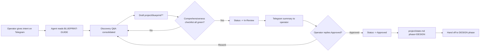

### Quality gates this guide enforces

| Stage              | Gate                                                                 | Who decides                     |
|--------------------|----------------------------------------------------------------------|---------------------------------|
| Discovery complete | All 8 required inputs answered or auto-derived with confidence       | Agent (self or peer per variant)|
| Draft complete     | Comprehensiveness checklist (§7) all green                            | Agent (self or peer per variant)|
| Approval           | Operator replied `Approved` on Telegram to the Blueprint summary     | **Operator (mandatory)**        |
| Pin                | `project/state.md` records `guideline_commit` matching this repo SHA | Agent                           |

---

## Table of Contents

1. [Requirements Gathering Methodology](#1-requirements-gathering-methodology)
2. [Blueprint Documentation Standards](#2-blueprint-documentation-standards)
3. [Technical Consideration Checklist — Sentinel / Circuit Breaker Design](#3-technical-consideration-checklist--sentinel--circuit-breaker-design)
4. [Technical Consideration Checklist — CQRS](#4-technical-consideration-checklist--cqrs)
5. [Technical Consideration Checklist — Security Concerns](#5-technical-consideration-checklist--security-concerns)
6. [Technical Consideration Checklist — User Access Rights](#6-technical-consideration-checklist--user-access-rights)
7. [Blueprint Comprehensiveness Checklist](#7-blueprint-comprehensiveness-checklist)
8. [Project Management & Progress Tracking](#8-project-management--progress-tracking)

---

## 1. Requirements Gathering Methodology

The System Architect is the **sole interface between the human user (via Telegram) and the entire GateForge agent pipeline**. Requirements gathering is the most critical upstream activity — errors here cascade downstream to every agent. This section defines a rigorous, repeatable methodology.

### 1.1 Step-by-Step Requirements Gathering Workflow

Follow this exact sequence for every new feature, project, or change request:

```
Step 1: RECEIVE    → Acknowledge the request within 60 seconds via Telegram
Step 2: PARSE      → Extract intent, scope, and implicit constraints
Step 3: CLASSIFY   → Functional vs Non-Functional; categorize by domain
Step 4: CLARIFY    → Ask targeted clarifying questions (max 5 per round)
Step 5: DECOMPOSE  → Break into user stories with acceptance criteria
Step 6: PRIORITIZE → Apply MoSCoW method with user confirmation
Step 7: VALIDATE   → Read back summary and get explicit Go/No-Go from user
Step 8: RECORD     → Write to blueprint.md and decision-log.md
Step 9: TRACE      → Create traceability matrix entries
```

#### Detailed Step Breakdown

**Step 1 — RECEIVE**
```
Architect → User (Telegram):
"✅ Received your request regarding [topic]. Let me analyze this 
and I'll come back with some clarifying questions."
```

**Step 2 — PARSE**
Extract from the user's message:
- [ ] **Primary intent**: What does the user want to accomplish?
- [ ] **Scope boundary**: What's explicitly included? What's implicitly excluded?
- [ ] **Stakeholders**: Who uses this feature? Who is affected?
- [ ] **Constraints mentioned**: Deadlines, budget, tech limitations
- [ ] **Assumed context**: What prior decisions or systems does this depend on?

**Step 3 — CLASSIFY**
Apply the Functional vs Non-Functional matrix (see Section 1.3 below).

**Step 4 — CLARIFY**
Use the Ambiguity Detection Framework (see Section 1.5 below). Never proceed with ambiguous requirements.

**Step 5 — DECOMPOSE**
Use the User Story Template (see Section 1.2 below).

**Step 6 — PRIORITIZE**
Apply MoSCoW with the user (see Section 1.4 below).

**Step 7 — VALIDATE**
```
Architect → User (Telegram):
"Here's my understanding of your requirements:

📋 Feature: [Name]
📝 Stories: [Count] user stories
🔴 Must-Have: [Count]
🟡 Should-Have: [Count]
🔵 Could-Have: [Count]

[Summary list of stories]

Does this accurately capture your intent? Any corrections before 
I commit to the Blueprint?"
```

**Step 8 — RECORD**
Commit to `blueprint.md` with a descriptive message: `docs: add requirements for [feature] — REQ-XXX`

**Step 9 — TRACE**
Update the Requirements Traceability Matrix (see Section 1.6 below).

---

### 1.2 User Story Template with Acceptance Criteria

Every requirement MUST be expressed as a user story with structured acceptance criteria.

#### User Story Format

```markdown
### US-[MODULE]-[NNN]: [Concise Title]

**As a** [role/persona],
**I want** [capability/action],
**So that** [business value/outcome].

**Priority:** [Must / Should / Could / Won't]
**Module:** [module-name]
**Epic:** [EPIC-NNN] (if applicable)
**Estimated Complexity:** [S / M / L / XL]

#### Acceptance Criteria

**AC-1: [Criteria Name]**
- **Given** [precondition / initial context]
- **When** [action / trigger event]
- **Then** [expected outcome / observable result]

**AC-2: [Criteria Name]**
- **Given** [precondition / initial context]
- **When** [action / trigger event]
- **Then** [expected outcome / observable result]

#### Negative / Edge Cases

**AC-N1: [Negative Scenario]**
- **Given** [precondition that leads to invalid state]
- **When** [user attempts invalid action]
- **Then** [system rejects gracefully with specific error message]

#### Non-Functional Criteria

- **Performance:** [e.g., Response time < 200ms at p95]
- **Security:** [e.g., Requires authenticated user with role X]
- **Accessibility:** [e.g., WCAG 2.1 AA compliant]

#### Dependencies
- Depends on: [US-XXX-NNN, TASK-NNN]
- Blocks: [US-XXX-NNN]

#### Notes
[Any additional context, design references, or constraints]
```

#### Example: Concrete User Story

```markdown
### US-AUTH-001: User Login with Email and Password

**As a** registered user,
**I want** to log in using my email and password,
**So that** I can access my personalized dashboard and data.

**Priority:** Must
**Module:** auth
**Epic:** EPIC-001 (User Authentication)
**Estimated Complexity:** M

#### Acceptance Criteria

**AC-1: Successful Login**
- **Given** a registered user with email "user@example.com" and valid password
- **When** the user submits correct credentials on the login form
- **Then** the system issues a JWT access token (15min TTL) and refresh token 
  (7d TTL), and redirects to `/dashboard`

**AC-2: Invalid Password**
- **Given** a registered user with email "user@example.com"
- **When** the user submits an incorrect password
- **Then** the system returns HTTP 401 with message "Invalid credentials" 
  (no indication of whether email or password is wrong)

**AC-3: Account Lockout**
- **Given** a user who has failed login 5 times within 15 minutes
- **When** the user attempts a 6th login
- **Then** the system locks the account for 30 minutes and returns HTTP 429 
  with message "Account temporarily locked. Try again later."

#### Negative / Edge Cases

**AC-N1: Non-existent Email**
- **Given** an email "nobody@example.com" that is not registered
- **When** the user submits this email with any password
- **Then** the system returns HTTP 401 with message "Invalid credentials" 
  (same message as wrong password — no user enumeration)

#### Non-Functional Criteria
- **Performance:** Login endpoint responds < 300ms at p95
- **Security:** Passwords hashed with bcrypt (cost factor 12); rate limiting 
  at 10 req/min per IP
- **Accessibility:** Login form is keyboard-navigable and screen-reader compatible

#### Dependencies
- Depends on: US-AUTH-000 (User Registration)
- Blocks: US-DASH-001 (Dashboard Loading)
```

---

### 1.3 Functional vs Non-Functional Requirements Classification

Use this matrix to classify every requirement:

| Category | Type | Description | Examples |
|----------|------|-------------|----------|
| **Functional** | Feature | What the system does | Login, CRUD operations, notifications |
| **Functional** | Business Rule | Domain logic and constraints | "Orders > $1000 require manager approval" |
| **Functional** | Integration | External system interactions | Payment gateway, email service, SMS |
| **Functional** | Data | Data storage, retrieval, transformation | Reports, exports, migrations |
| **Non-Functional** | Performance | Speed, throughput, latency | "API response < 200ms at p95" |
| **Non-Functional** | Scalability | Growth handling | "Support 10K concurrent users" |
| **Non-Functional** | Security | Protection, compliance | Authentication, encryption, OWASP |
| **Non-Functional** | Reliability | Uptime, fault tolerance | "99.9% availability SLA" |
| **Non-Functional** | Usability | User experience quality | "WCAG 2.1 AA", "Mobile-first" |
| **Non-Functional** | Maintainability | Code quality, deployment | "CI/CD pipeline", "Conventional Commits" |
| **Non-Functional** | Observability | Monitoring, logging, tracing | Prometheus metrics, structured logs |
| **Non-Functional** | Compliance | Regulatory requirements | GDPR, SOC 2, PCI-DSS |

#### Classification Checklist

For every requirement, answer:

- [ ] Is this a **what** (functional) or a **how well** (non-functional)?
- [ ] Does this affect the UI/API contract? → Functional
- [ ] Does this affect system qualities (speed, security, reliability)? → Non-Functional
- [ ] Does this have measurable acceptance criteria with numeric thresholds? → Likely Non-Functional
- [ ] Does this describe a user interaction or workflow? → Functional

---

### 1.4 Requirement Priority Matrix (MoSCoW Method)

| Priority | Label | Definition | Rule |
|----------|-------|------------|------|
| **Must** | 🔴 M | Non-negotiable for this release. System is unusable without it. | Cannot be descoped. If blocked, escalate immediately. |
| **Should** | 🟡 S | Important but not critical. Workaround exists if delayed. | Can be deferred to next sprint with user approval. |
| **Could** | 🔵 C | Nice-to-have. Enhances UX or developer experience. | First to be cut if timeline is tight. |
| **Won't** | ⚪ W | Explicitly out of scope for this release. Documented for future. | Record in `decision-log.md` with rationale. |

#### Priority Decision Matrix

Use this decision tree to assign priority:

```
Q1: Is the system fundamentally broken without this?
  → YES → Must
  → NO  → Continue

Q2: Would > 50% of users be significantly impacted without this?
  → YES → Should
  → NO  → Continue

Q3: Does this improve UX, DX, or competitive position?
  → YES → Could
  → NO  → Won't (for this release)
```

#### Priority Distribution Guidelines

For a healthy release, aim for:

| Priority | Target % of Stories | Ceiling |
|----------|-------------------|---------|
| Must | 50-60% | Never exceed 60% |
| Should | 20-30% | — |
| Could | 10-20% | — |
| Won't | Documented | No minimum |

If Must items exceed 60%, the scope is too large — negotiate with the user to split the release.

---

### 1.5 Ambiguity Detection and Clarifying Questions

#### Ambiguity Signal Words

When the user's request contains any of these, it is ambiguous and requires clarification:

| Signal | Why It's Ambiguous | Clarifying Question Template |
|--------|-------------------|------------------------------|
| "fast" / "quick" / "performant" | No numeric threshold | "What response time is acceptable? e.g., < 200ms at p95?" |
| "secure" / "safe" | Too broad | "Which security concerns specifically? Auth, encryption, input validation, or all?" |
| "easy to use" | Subjective | "Who is the target user? What's their technical proficiency?" |
| "similar to [product]" | Unclear which aspects | "Which specific features of [product] should we replicate?" |
| "handle errors" / "robust" | No failure strategy defined | "What should happen on failure? Retry? Fallback? Alert?" |
| "flexible" / "configurable" | Scope unbounded | "Which parameters should be configurable? By whom? At runtime or deploy time?" |
| "etc." / "and so on" | Incomplete list | "Can you enumerate the complete list? Unbounded scope causes downstream issues." |
| "should work on mobile" | RWD? Native? Hybrid? | "React Native (our stack) or responsive web? Which screen sizes?" |
| "integrate with X" | Direction, protocol, auth unknown | "Push or pull? REST, GraphQL, webhook? What auth does X require?" |
| "real-time" | WebSocket? SSE? Polling? Latency? | "What latency is acceptable? < 1s? < 100ms? What transport: WS, SSE?" |

#### Clarifying Question Framework

Structure clarifying questions in batches of max 5, grouped by theme:

```
Architect → User (Telegram):

I have a few questions to make sure I capture this correctly:

**Scope:**
1. When you say "manage users," does that include user registration, 
   or only admin management of existing users?

**Behavior:**
2. What should happen when [edge case]?
3. Is [X] a hard requirement or a preference?

**Constraints:**
4. Is there a deadline for this feature?
5. Are there any third-party service constraints I should know about?
```

---

### 1.6 Requirements Traceability Matrix (RTM) Template

Maintain in `blueprint.md` under a dedicated section:

```markdown
## Requirements Traceability Matrix

| Req ID | User Story | Priority | Design Ref | Task IDs | Test Cases | Status |
|--------|-----------|----------|------------|----------|------------|--------|
| REQ-001 | US-AUTH-001 | Must | arch.md#auth-flow | TASK-001, TASK-002 | TC-AUTH-001..003 | ✅ Implemented |
| REQ-002 | US-AUTH-002 | Must | arch.md#jwt-strategy | TASK-003 | TC-AUTH-004..006 | 🔄 In Progress |
| REQ-003 | US-DASH-001 | Should | arch.md#dashboard | — | — | 📋 Specified |
| REQ-004 | US-NOTIF-001 | Could | — | — | — | 📝 Draft |
```

**Status Legend:**
- 📝 Draft — Requirements captured but not validated
- 📋 Specified — Validated by user, acceptance criteria complete
- 🎨 Designed — Architecture/design completed
- 🔄 In Progress — Development underway
- 🧪 Testing — QC executing test cases
- ✅ Implemented — All quality gates passed
- ❌ Rejected — Descoped with rationale in decision-log

---

## 2. Blueprint Documentation Standards

The Blueprint is the **single source of truth** for the entire GateForge pipeline. Only the System Architect writes to Blueprint files. All other agents propose changes via structured JSON reports, which the Architect validates and commits.

### 2.1 Blueprint File Structure

```
project-root/
├── blueprint.md            # Master requirements and specifications
├── architecture.md         # Technical architecture decisions
├── status.md               # Current project status dashboard
├── decision-log.md         # Append-only log of all decisions
├── diagrams/               # Mermaid source files (optional)
│   ├── system-context.mmd
│   ├── data-flow.mmd
│   └── sequence-*.mmd
└── adr/                    # Architecture Decision Records (optional)
    ├── ADR-001-*.md
    └── ADR-002-*.md
```

### 2.2 Blueprint.md Structure

```markdown
# [Project Name] — Blueprint

| Field | Value |
|-------|-------|
| Version | [semver] |
| Last Updated | [ISO-8601] |
| Owner | System Architect (VM-1) |
| Status | Draft / In Review / Approved / Superseded |

## 1. Project Overview
Brief description of the project, its purpose, and business value.

## 2. Stakeholders
| Name | Role | Responsibilities |
|------|------|-----------------|
| the end-user | Product Owner | Final sign-off on all requirements |
| System Architect | Technical Lead | Blueprint ownership, quality gates |

## 3. Scope
### 3.1 In Scope
- [Explicit list of included features/modules]

### 3.2 Out of Scope
- [Explicit list of excluded items with rationale]

## 4. Requirements
### 4.1 Epics
### 4.2 User Stories
[Full user stories with acceptance criteria per Section 1.2]

### 4.3 Non-Functional Requirements
[Categorized per Section 1.3]

## 5. Requirements Traceability Matrix
[Per Section 1.6]

## 6. Glossary
| Term | Definition |
|------|-----------|
| [Term] | [Definition] |

## Revision History
| Version | Date | Author | Changes |
|---------|------|--------|---------|
| 1.0.0 | [date] | Architect | Initial blueprint |
```

### 2.3 Architecture.md Structure

```markdown
# [Project Name] — Architecture Document

## 1. System Context
High-level system context diagram showing external actors and systems.

## 2. Container Diagram
Services, databases, message queues, and their interactions.

## 3. Component Design
Per-module component breakdown.

## 4. Data Architecture
### 4.1 Entity-Relationship Diagram
### 4.2 Database Schema
### 4.3 Data Flow

## 5. API Contracts
### 5.1 REST Endpoints
### 5.2 WebSocket Events
### 5.3 Inter-Service Messages

## 6. Infrastructure
### 6.1 Deployment Architecture
### 6.2 Kubernetes Manifests Summary
### 6.3 CI/CD Pipeline

## 7. Cross-Cutting Concerns
### 7.1 Authentication & Authorization
### 7.2 Logging & Monitoring
### 7.3 Error Handling Strategy
### 7.4 Circuit Breaker / Resilience

## 8. Security Architecture
[Reference Section 5 of this guide]

## 9. Rollback Strategy
[Every design MUST include rollback — per SOUL.md constraints]
```

### 2.4 Status.md Structure

```markdown
# [Project Name] — Status Dashboard

**Last Updated:** [ISO-8601 timestamp]
**Overall Health:** 🟢 On Track / 🟡 At Risk / 🔴 Blocked

## Sprint Summary
| Metric | Value |
|--------|-------|
| Sprint | [N] |
| Stories Completed | [X / Y] |
| Must Items Remaining | [N] |
| Blockers | [N] |

## Agent Status
| Agent | VM | Current Task | Status | Last Report |
|-------|-----|-------------|--------|-------------|
| Designer | VM-2 | TASK-005 | 🔄 In Progress | 2026-04-06 |
| dev-01 | VM-3 | TASK-003 | ✅ Complete | 2026-04-06 |
| qc-01 | VM-4 | TASK-003 | 🔄 Testing | 2026-04-06 |
| Operator | VM-5 | — | ⏸ Idle | — |

## Blockers
| ID | Description | Owner | Escalation |
|----|-------------|-------|-----------|
| BLK-001 | [Description] | [Agent] | [Action needed] |

## Quality Gate Results
| Gate | Task | Result | Date |
|------|------|--------|------|
| Code Review | TASK-003 | ✅ Pass | 2026-04-06 |
| QA Gate | TASK-002 | ❌ Fail (retry 1/3) | 2026-04-05 |
```

### 2.5 Decision-Log.md Structure

```markdown
# [Project Name] — Decision Log

> Append-only. Never delete or modify past entries.

## DEC-[NNN] — [Decision Title]

| Field | Value |
|-------|-------|
| Date | [ISO-8601] |
| Decision Maker | [Architect / Human / Joint] |
| Context | [What prompted this decision] |
| Decision | [What was decided] |
| Rationale | [Why this option was chosen] |
| Alternatives Considered | [Other options and why they were rejected] |
| Impact | [What changes as a result] |
| Status | Accepted / Superseded by DEC-[NNN] |

---
```

### 2.6 Versioning and Diffing Blueprint Changes

#### Versioning Rules

| Change Type | Version Bump | Example |
|-------------|-------------|---------|
| New epic/module added | Minor (x.Y.0) | 1.0.0 → 1.1.0 |
| User story added/modified within existing epic | Patch (x.y.Z) | 1.1.0 → 1.1.1 |
| Architecture redesign or breaking contract change | Major (X.0.0) | 1.1.1 → 2.0.0 |
| Status update only | No bump | — |

#### Git Commit Convention

```
docs: update blueprint — [description]
docs: add ADR-NNN — [decision title]
docs: update status — TASK-NNN [completed|failed]
docs: update decision-log — DEC-NNN [decision title]
```

---

### 2.7 Workflow Diagram Standards (Mermaid Syntax)

All diagrams MUST use [Mermaid](https://mermaid.js.org/) syntax for version-controllable, text-based diagrams.

#### 2.7.1 Sequence Diagrams — API Call Flow

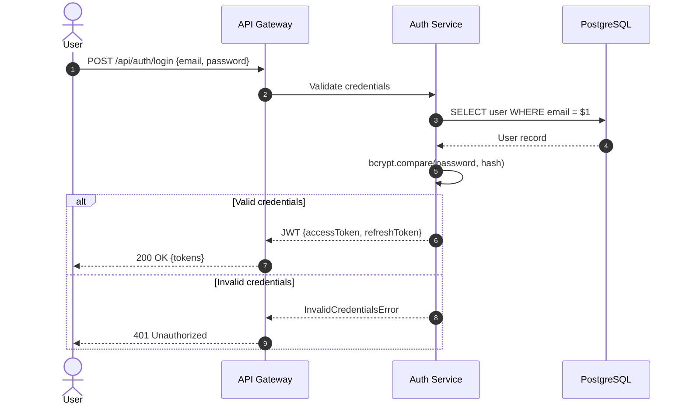

#### 2.7.2 Sequence Diagrams — Async Message Flow

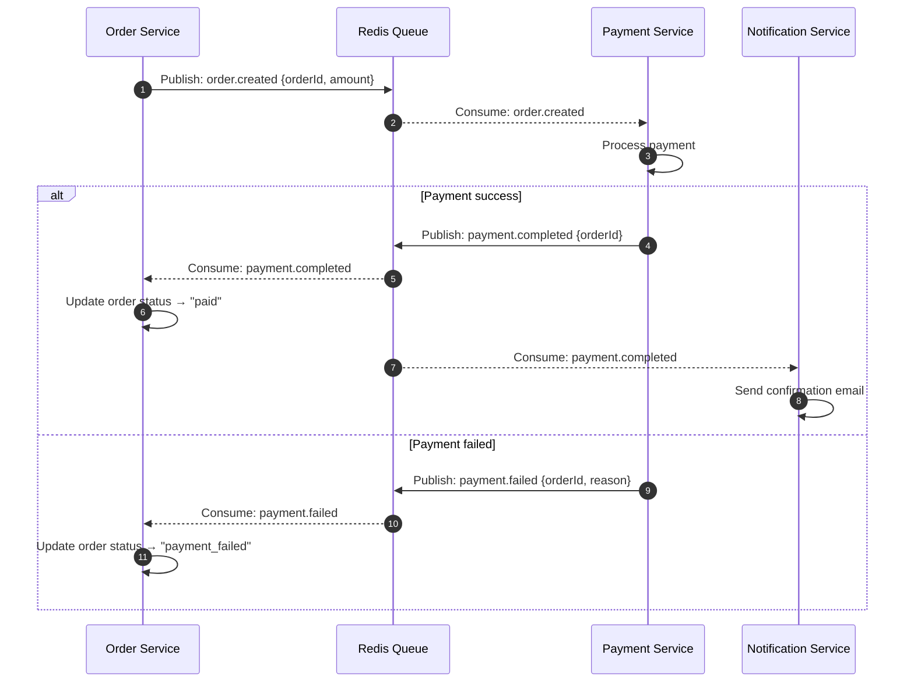

#### 2.7.3 Sequence Diagrams — Error Handling Flow with Circuit Breaker

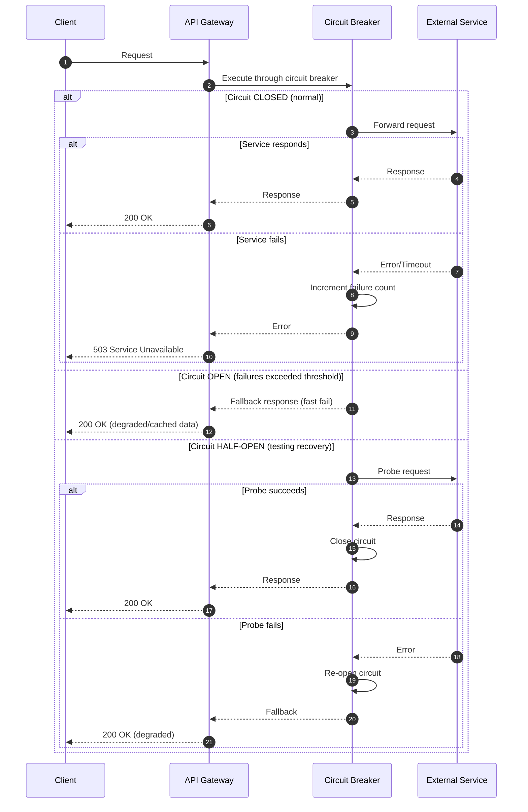

#### 2.7.4 Flowcharts — Decision Process

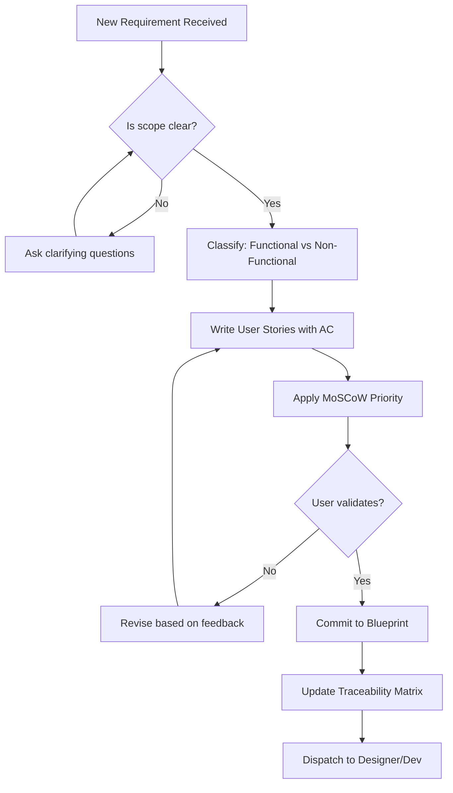

#### 2.7.5 State Machine Diagrams

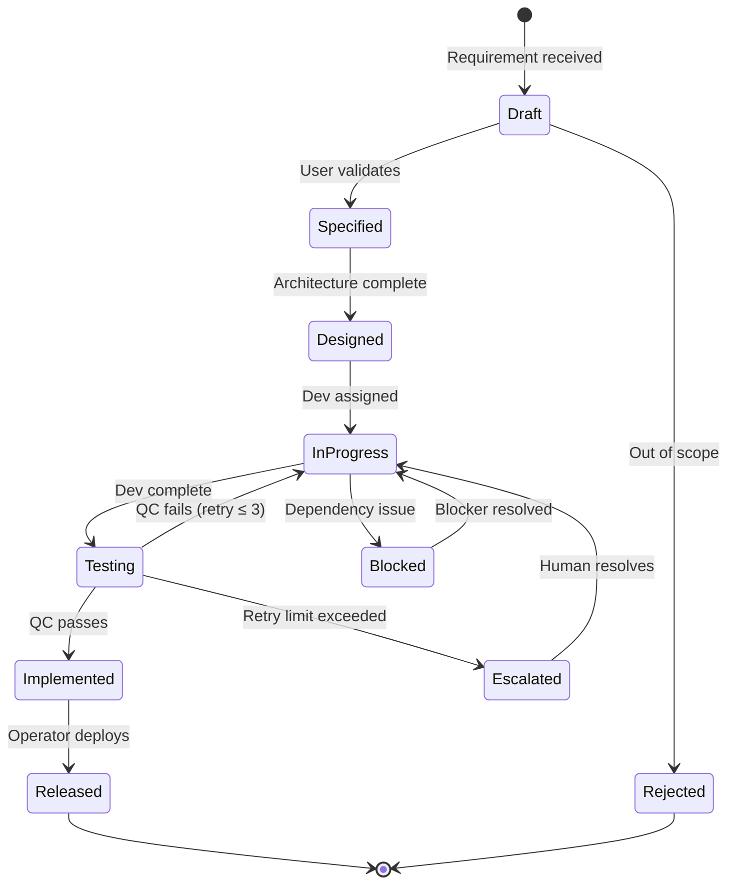

#### 2.7.6 Component Diagrams

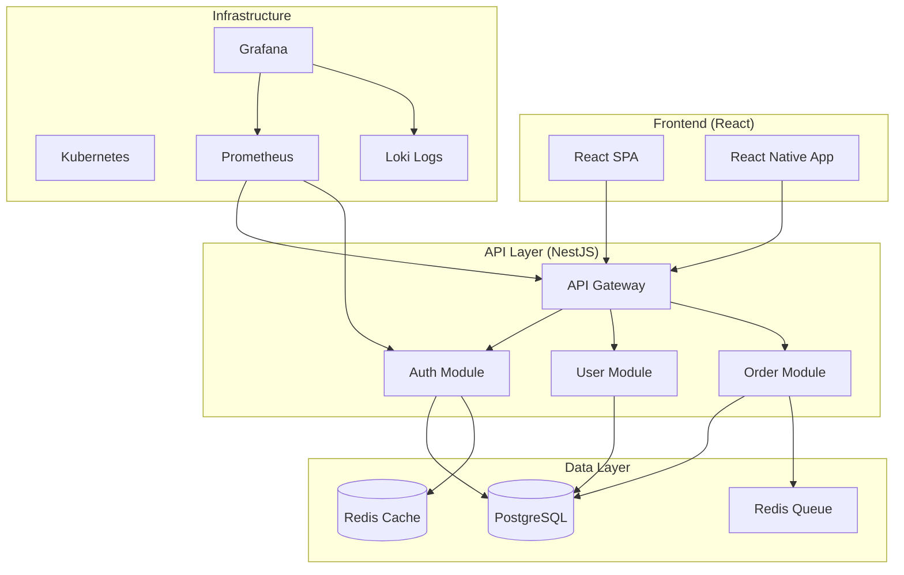

#### 2.7.7 Data Flow Diagrams

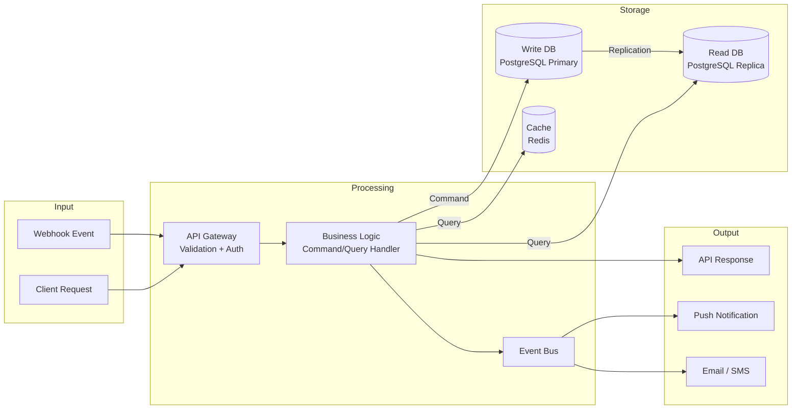

---

## 3. Technical Consideration Checklist — Sentinel / Circuit Breaker Design

### 3.1 What Is the Circuit Breaker Pattern?

The circuit breaker pattern is a resilience mechanism that prevents cascading failures in distributed systems. Named after electrical circuit breakers, it **monitors calls to an external dependency and stops sending requests when failures exceed a threshold**, allowing the failing service time to recover.

In the GateForge microservices architecture (NestJS, Docker, Kubernetes), circuit breakers are essential for:
- Service-to-service REST/gRPC calls
- External API integrations (payment gateways, email services, SMS)
- Database connection management
- Redis cache operations

Reference: [Circuit Breaker Pattern in Microservices — Talent500](https://talent500.com/blog/circuit-breaker-pattern-microservices-design-best-practices/), [Building Resilient Microservices — Statsig](https://www.statsig.com/perspectives/building-resilient-microservices-lessons-from-the-field)

### 3.2 Circuit Breaker States

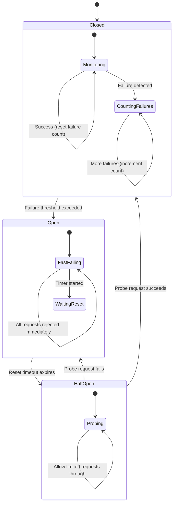

| State | Behavior | Transitions |
|-------|----------|-------------|
| **Closed** | All requests pass through normally. Failures are counted. | → Open: when failure count ≥ threshold within rolling window |
| **Open** | All requests are immediately rejected (fail-fast). Fallback is invoked if configured. | → Half-Open: after `resetTimeout` expires |
| **Half-Open** | A limited number of probe requests are allowed through to test recovery. | → Closed: if probe succeeds → Open: if probe fails |

### 3.3 Configuration Parameters

| Parameter | Description | Recommended Default | Tuning Guidance |
|-----------|-------------|-------------------|-----------------|
| `timeout` | Max time for a single request before it's considered failed | 3000–5000ms | Match the dependency's p99 latency + buffer |
| `errorThresholdPercentage` | % of failures in the rolling window that trips the circuit | 50% | Lower (30%) for critical paths (payments); higher (70%) for non-critical |
| `resetTimeout` | Time to wait in Open state before trying Half-Open | 30000ms (30s) | Increase for slow-recovering services |
| `rollingCountTimeout` | Duration of the statistical rolling window | 10000ms (10s) | Longer windows smooth out spikes but delay detection |
| `rollingCountBuckets` | Number of buckets in the rolling window | 10 | Higher = more granular but more memory |
| `volumeThreshold` | Minimum requests in window before circuit can trip | 5 | Prevents tripping on low traffic |

Reference: [Opossum Documentation — Nodeshift](https://nodeshift.dev/opossum/)

### 3.4 Retry Policy

Define retry behavior **before** the circuit breaker trips:

| Strategy | Description | Use When |
|----------|-------------|----------|
| **Immediate retry** | Retry instantly | Transient network glitch (rare) |
| **Exponential backoff** | Wait 1s, 2s, 4s, 8s... | Rate-limited APIs, overloaded services |
| **Exponential backoff + jitter** | Backoff with random variation | Multiple clients calling same service (avoids thundering herd) |
| **No retry** | Fail immediately | Idempotency cannot be guaranteed |

```typescript
// Retry with exponential backoff + jitter
function calculateDelay(attempt: number, baseDelay = 1000, maxDelay = 30000): number {
  const exponential = baseDelay * Math.pow(2, attempt);
  const jitter = Math.random() * baseDelay;
  return Math.min(exponential + jitter, maxDelay);
}
```

### 3.5 Fallback Strategy

Every circuit breaker MUST have a defined fallback:

| Fallback Type | Description | Example |
|---------------|-------------|---------|
| **Cached response** | Return last known good response | Product catalog from Redis cache |
| **Default value** | Return a safe default | Empty array, default config |
| **Degraded service** | Partial functionality | Show cached prices, disable real-time updates |
| **Queue for retry** | Accept and process later | Queue order for later payment processing |
| **Graceful error** | Inform user clearly | "Service temporarily unavailable, try again in 30s" |

### 3.6 NestJS Implementation with Opossum

#### Installation

```bash
npm install opossum opossum-prom
npm install -D @types/opossum
```

#### Circuit Breaker Service (Reusable)

```typescript
// src/common/resilience/circuit-breaker.service.ts
import { Injectable, Logger } from '@nestjs/common';
import * as CircuitBreaker from 'opossum';
import { instrument } from 'opossum-prom';

export interface CircuitBreakerOptions {
  name: string;
  timeout?: number;
  errorThresholdPercentage?: number;
  resetTimeout?: number;
  volumeThreshold?: number;
  fallback?: (...args: any[]) => any;
}

@Injectable()
export class CircuitBreakerService {
  private readonly logger = new Logger(CircuitBreakerService.name);
  private readonly breakers = new Map<string, CircuitBreaker>();

  create<T>(
    action: (...args: any[]) => Promise<T>,
    options: CircuitBreakerOptions,
  ): CircuitBreaker {
    const breaker = new CircuitBreaker(action, {
      timeout: options.timeout ?? 5000,
      errorThresholdPercentage: options.errorThresholdPercentage ?? 50,
      resetTimeout: options.resetTimeout ?? 30000,
      volumeThreshold: options.volumeThreshold ?? 5,
      rollingCountTimeout: 10000,
      rollingCountBuckets: 10,
    });

    // Register fallback
    if (options.fallback) {
      breaker.fallback(options.fallback);
    }

    // Instrument for Prometheus metrics
    instrument(breaker, { name: options.name });

    // Log state transitions
    breaker.on('open', () =>
      this.logger.warn(`Circuit breaker [${options.name}] OPENED`),
    );
    breaker.on('halfOpen', () =>
      this.logger.log(`Circuit breaker [${options.name}] HALF-OPEN`),
    );
    breaker.on('close', () =>
      this.logger.log(`Circuit breaker [${options.name}] CLOSED`),
    );
    breaker.on('fallback', () =>
      this.logger.warn(`Circuit breaker [${options.name}] FALLBACK invoked`),
    );

    this.breakers.set(options.name, breaker);
    return breaker;
  }

  get(name: string): CircuitBreaker | undefined {
    return this.breakers.get(name);
  }

  getAll(): Map<string, CircuitBreaker> {
    return this.breakers;
  }
}
```

#### Usage in a Service

```typescript
// src/modules/payment/payment.service.ts
import { Injectable, OnModuleInit } from '@nestjs/common';
import { HttpService } from '@nestjs/axios';
import * as CircuitBreaker from 'opossum';
import { CircuitBreakerService } from '../../common/resilience/circuit-breaker.service';

@Injectable()
export class PaymentService implements OnModuleInit {
  private paymentBreaker: CircuitBreaker;

  constructor(
    private readonly httpService: HttpService,
    private readonly cbService: CircuitBreakerService,
  ) {}

  onModuleInit() {
    this.paymentBreaker = this.cbService.create(
      (orderId: string, amount: number) => this.processPaymentInternal(orderId, amount),
      {
        name: 'payment_gateway',
        timeout: 5000,
        errorThresholdPercentage: 30, // Lower tolerance for payments
        resetTimeout: 60000,          // Wait longer before retrying
        fallback: (orderId: string) => ({
          status: 'queued',
          message: 'Payment queued for processing. You will be notified.',
          orderId,
        }),
      },
    );
  }

  async processPayment(orderId: string, amount: number) {
    return this.paymentBreaker.fire(orderId, amount);
  }

  private async processPaymentInternal(orderId: string, amount: number) {
    const response = await this.httpService.axiosRef.post(
      process.env.PAYMENT_GATEWAY_URL,
      { orderId, amount },
      { timeout: 4000 },
    );
    return response.data;
  }
}
```

#### Health Check Integration

```typescript
// src/common/health/circuit-breaker.health.ts
import { Injectable } from '@nestjs/common';
import { HealthIndicator, HealthIndicatorResult, HealthCheckError } from '@nestjs/terminus';
import { CircuitBreakerService } from '../resilience/circuit-breaker.service';

@Injectable()
export class CircuitBreakerHealthIndicator extends HealthIndicator {
  constructor(private readonly cbService: CircuitBreakerService) {
    super();
  }

  check(key: string): HealthIndicatorResult {
    const breakers = this.cbService.getAll();
    const openBreakers: string[] = [];

    breakers.forEach((breaker, name) => {
      if (breaker.opened) {
        openBreakers.push(name);
      }
    });

    const isHealthy = openBreakers.length === 0;
    const result = this.getStatus(key, isHealthy, {
      openCircuits: openBreakers,
      totalCircuits: breakers.size,
    });

    if (!isHealthy) {
      throw new HealthCheckError('Circuit breaker check failed', result);
    }
    return result;
  }
}
```

### 3.7 Monitoring Circuit Breaker State via Prometheus

The `opossum-prom` package automatically exposes the following metrics when instrumented:

| Metric | Type | Labels | Purpose |
|--------|------|--------|---------|
| `circuit_breaker_state` | Gauge | `name` | 0=closed, 1=open, 2=half-open |
| `circuit_breaker_requests_total` | Counter | `name`, `result` | Total calls by outcome |
| `circuit_breaker_failures_total` | Counter | `name` | Total failures |
| `circuit_breaker_fallbacks_total` | Counter | `name` | Times fallback invoked |
| `circuit_breaker_timeouts_total` | Counter | `name` | Timed-out calls |
| `circuit_breaker_rejects_total` | Counter | `name` | Rejected while open |

Reference: [Prometheus Metrics for Node.js Circuit Breakers — DEV Community](https://dev.to/axiom_agent/prometheus-metrics-for-your-nodejs-circuit-breakers-opossum-prom-3b31)

#### Prometheus Alert Rules

```yaml
# prometheus/alerts/circuit-breakers.yml
groups:
  - name: circuit_breakers
    rules:
      - alert: CircuitBreakerOpen
        expr: circuit_breaker_state == 1
        for: 1m
        labels:
          severity: warning
        annotations:
          summary: "Circuit breaker {{ $labels.name }} is OPEN"
          description: >
            {{ $labels.name }} has been in OPEN state for > 1 minute.
            Requests are being rejected or falling back.

      - alert: CircuitBreakerHighFailureRate
        expr: |
          rate(circuit_breaker_failures_total[5m])
          / rate(circuit_breaker_requests_total[5m]) > 0.10
        for: 2m
        labels:
          severity: critical
        annotations:
          summary: "Circuit breaker {{ $labels.name }} failure rate > 10%"

      - alert: CircuitBreakerHighLatency
        expr: |
          histogram_quantile(0.95,
            sum by (name, le) (
              rate(circuit_breaker_duration_seconds_bucket[5m])
            )
          ) > 2
        for: 3m
        labels:
          severity: warning
        annotations:
          summary: "Circuit breaker {{ $labels.name }} p95 latency > 2s"
```

#### Grafana Dashboard Queries

```
# Panel: Circuit Breaker State (stat panel per breaker)
circuit_breaker_state

# Panel: Request rate by breaker (time series)
sum by (name) (rate(circuit_breaker_requests_total[5m]))

# Panel: Failure rate % (time series)
sum by (name) (rate(circuit_breaker_failures_total[5m]))
/ sum by (name) (rate(circuit_breaker_requests_total[5m])) * 100

# Panel: Fallback invocation rate (time series)
sum by (name) (rate(circuit_breaker_fallbacks_total[5m]))
```

### 3.8 Decision Matrix: Circuit Breaker vs Retry vs Bulkhead

| Scenario | Circuit Breaker | Retry | Bulkhead | Recommended Combination |
|----------|:-:|:-:|:-:|---|
| External API intermittent errors | ✅ | ✅ | ❌ | Retry (3x, backoff) → Circuit Breaker |
| External API sustained outage | ✅ | ❌ | ❌ | Circuit Breaker with fallback |
| Database connection pool exhaustion | ❌ | ❌ | ✅ | Bulkhead (limit concurrent connections) |
| Slow downstream service | ✅ | ❌ | ✅ | Circuit Breaker (timeout) + Bulkhead |
| Network partition between services | ✅ | ✅ | ❌ | Retry (with jitter) → Circuit Breaker |
| Multiple downstream dependencies | ✅ | ✅ | ✅ | All three — isolate each dependency |
| Idempotent write operations | ❌ | ✅ | ❌ | Retry (safe to repeat) |
| Non-idempotent write operations | ✅ | ❌ | ❌ | Circuit Breaker only (no retry) |

Reference: [Guide to Microservices Resilience Patterns — JRebel](https://www.jrebel.com/blog/microservices-resilience-patterns)

### 3.9 Circuit Breaker Design Checklist

For every external dependency or inter-service call, verify:

- [ ] Circuit breaker wraps the call with appropriate timeout
- [ ] Failure threshold and reset timeout are tuned for the dependency
- [ ] Fallback strategy is defined and tested
- [ ] Health check probes the dependency
- [ ] Prometheus metrics are instrumented via `opossum-prom`
- [ ] Grafana dashboard panel exists for the breaker
- [ ] Prometheus alert rule exists for OPEN state > 1 minute
- [ ] Fallback behavior is documented in `architecture.md`
- [ ] Circuit breaker is integration-tested (mock the dependency to fail)
- [ ] Rollback strategy exists if the circuit breaker config causes issues

---

## 4. Technical Consideration Checklist — CQRS

### 4.1 What Is CQRS?

**Command Query Responsibility Segregation (CQRS)** separates read operations (queries) from write operations (commands) into distinct models. Instead of using the same data model and service for both reads and writes, CQRS uses:

- **Command Side**: Handles create, update, delete operations. Optimized for data integrity and business rule enforcement.
- **Query Side**: Handles read operations. Optimized for performance, denormalized views, and flexible projections.

Reference: [CQRS and Event Sourcing — Useful Functions](https://www.usefulfunctions.co.uk/2025/11/06/cqrs-and-event-sourcing-when-to-use/), [CQRS Pattern in NestJS — DEV Community](https://dev.to/jacobandrewsky/cqrs-pattern-in-nestjs-4n3p)

### 4.2 When to Use CQRS vs Simple CRUD

#### Decision Criteria Checklist

Use this checklist to decide whether CQRS is warranted:

| # | Criterion | Yes → CQRS | No → CRUD |
|---|-----------|:---:|:---:|
| 1 | Read and write workloads have **very different** scaling requirements | ✅ | ❌ |
| 2 | Read model needs **different shape** than write model (denormalized views, projections) | ✅ | ❌ |
| 3 | **Complex domain logic** on writes (validation, business rules, sagas) | ✅ | ❌ |
| 4 | Need **audit trail** of all state changes | ✅ | ❌ |
| 5 | **Multiple read views** from same data (dashboard, reports, search) | ✅ | ❌ |
| 6 | Team size supports maintaining **two models** | ✅ | ❌ |
| 7 | **Eventual consistency** is acceptable for reads | ✅ | ❌ |
| 8 | Simple CRUD with < 5 entities, low traffic | ❌ | ✅ |
| 9 | Prototyping or MVP phase | ❌ | ✅ |
| 10 | Team has no experience with CQRS | ❌ | ✅ |

**Scoring:** If ≥ 4 items point to CQRS → use CQRS. If < 4 → use simple CRUD. Record the decision in `decision-log.md`.

#### Decision Flowchart

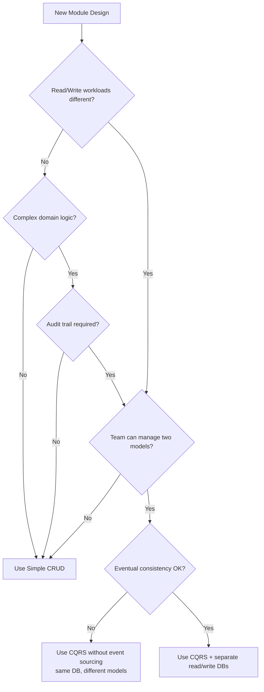

### 4.3 Read Model vs Write Model Separation

| Aspect | Write Model (Command) | Read Model (Query) |
|--------|----------------------|-------------------|
| **Purpose** | Enforce business rules, validate data | Serve data for UI/reports |
| **Shape** | Normalized, relational | Denormalized, optimized for queries |
| **Database** | PostgreSQL (primary) | PostgreSQL (replica) or Redis cache |
| **Consistency** | Strong (ACID transactions) | Eventual (async projection update) |
| **Performance Priority** | Data integrity | Read latency |
| **Schema** | Matches domain model | Matches view/API response |
| **Access Pattern** | Single entity writes | Multi-entity reads, aggregations |

### 4.4 Event Sourcing Considerations

Event sourcing stores every state change as an immutable event, rather than storing only the current state. It pairs naturally with CQRS but is NOT required.

#### When to Pair CQRS with Event Sourcing

| Criterion | Event Sourcing Needed | Event Sourcing Overkill |
|-----------|:---:|:---:|
| Full audit trail of every state change required | ✅ | |
| Regulatory compliance requires immutable history | ✅ | |
| Need to replay events to rebuild state | ✅ | |
| Temporal queries ("what was state at time T?") | ✅ | |
| Simple CRUD with current-state-only queries | | ✅ |
| Team lacks event sourcing experience | | ✅ |
| High-throughput writes where event log growth is a concern | | ✅ |

Reference: [Integrating Event Driven Architecture with CQRS — We-Archers](https://we-archers.com/integration-insights/integrating-an-event-driven-architecture-with-a-micro-services-architecture-using-event-sourcing-and-cqrs/)

### 4.5 NestJS CQRS Module Patterns

The `@nestjs/cqrs` package provides first-class support for CQRS with `CommandBus`, `QueryBus`, and `EventBus`.

Reference: [Building NestJS Applications Following CQRS — Telerik](https://www.telerik.com/blogs/building-nestjs-applications-following-the-cqrs-model), [Implementing CQRS in NestJS — Stackademic](https://blog.stackademic.com/implementing-the-cqrs-pattern-in-nestjs-with-a-note-api-example-c5d89fc940e)

#### Installation

```bash
npm install @nestjs/cqrs
```

#### Module Setup

```typescript
// src/app.module.ts
import { Module } from '@nestjs/common';
import { CqrsModule } from '@nestjs/cqrs';
import { OrdersModule } from './orders/orders.module';

@Module({
  imports: [CqrsModule.forRoot(), OrdersModule],
})
export class AppModule {}
```

#### Command Definition and Handler

```typescript
// src/orders/commands/create-order.command.ts
export class CreateOrderCommand {
  constructor(
    public readonly userId: string,
    public readonly items: Array<{ productId: string; quantity: number }>,
    public readonly shippingAddress: string,
  ) {}
}

// src/orders/commands/create-order.handler.ts
import { CommandHandler, ICommandHandler, EventBus } from '@nestjs/cqrs';
import { CreateOrderCommand } from './create-order.command';
import { OrderCreatedEvent } from '../events/order-created.event';
import { OrderRepository } from '../repositories/order.repository';

@CommandHandler(CreateOrderCommand)
export class CreateOrderHandler implements ICommandHandler<CreateOrderCommand> {
  constructor(
    private readonly orderRepository: OrderRepository,
    private readonly eventBus: EventBus,
  ) {}

  async execute(command: CreateOrderCommand): Promise<string> {
    const { userId, items, shippingAddress } = command;

    // Business rule validation
    if (items.length === 0) {
      throw new Error('Order must contain at least one item');
    }

    // Create aggregate
    const order = await this.orderRepository.create({
      userId,
      items,
      shippingAddress,
      status: 'pending',
      createdAt: new Date(),
    });

    // Publish domain event
    this.eventBus.publish(new OrderCreatedEvent(order.id, userId, items));

    return order.id;
  }
}
```

#### Query Definition and Handler

```typescript
// src/orders/queries/get-order.query.ts
export class GetOrderQuery {
  constructor(public readonly orderId: string) {}
}

// src/orders/queries/get-order.handler.ts
import { IQueryHandler, QueryHandler } from '@nestjs/cqrs';
import { GetOrderQuery } from './get-order.query';
import { OrderReadRepository } from '../repositories/order-read.repository';

@QueryHandler(GetOrderQuery)
export class GetOrderHandler implements IQueryHandler<GetOrderQuery> {
  constructor(private readonly readRepo: OrderReadRepository) {}

  async execute(query: GetOrderQuery) {
    return this.readRepo.findById(query.orderId);
  }
}

// src/orders/queries/list-user-orders.query.ts
export class ListUserOrdersQuery {
  constructor(
    public readonly userId: string,
    public readonly page: number = 1,
    public readonly limit: number = 20,
  ) {}
}

@QueryHandler(ListUserOrdersQuery)
export class ListUserOrdersHandler implements IQueryHandler<ListUserOrdersQuery> {
  constructor(private readonly readRepo: OrderReadRepository) {}

  async execute(query: ListUserOrdersQuery) {
    return this.readRepo.findByUserId(query.userId, query.page, query.limit);
  }
}
```

#### Event Definition and Handler

```typescript
// src/orders/events/order-created.event.ts
export class OrderCreatedEvent {
  constructor(
    public readonly orderId: string,
    public readonly userId: string,
    public readonly items: Array<{ productId: string; quantity: number }>,
  ) {}
}

// src/orders/events/order-created.handler.ts
import { EventsHandler, IEventHandler } from '@nestjs/cqrs';
import { OrderCreatedEvent } from './order-created.event';
import { OrderReadRepository } from '../repositories/order-read.repository';
import { NotificationService } from '../../notifications/notification.service';

@EventsHandler(OrderCreatedEvent)
export class OrderCreatedHandler implements IEventHandler<OrderCreatedEvent> {
  constructor(
    private readonly readRepo: OrderReadRepository,
    private readonly notificationService: NotificationService,
  ) {}

  async handle(event: OrderCreatedEvent) {
    // Update read model (projection)
    await this.readRepo.createProjection({
      orderId: event.orderId,
      userId: event.userId,
      itemCount: event.items.length,
      status: 'pending',
      createdAt: new Date(),
    });

    // Side effects
    await this.notificationService.sendOrderConfirmation(
      event.userId,
      event.orderId,
    );
  }
}
```

#### Saga (Cross-Aggregate Orchestration)

```typescript
// src/orders/sagas/order.saga.ts
import { Injectable } from '@nestjs/common';
import { Saga, ICommand, ofType } from '@nestjs/cqrs';
import { Observable, map, delay } from 'rxjs';
import { OrderCreatedEvent } from '../events/order-created.event';
import { ProcessPaymentCommand } from '../../payments/commands/process-payment.command';

@Injectable()
export class OrderSaga {
  @Saga()
  orderCreated = (events$: Observable<any>): Observable<ICommand> => {
    return events$.pipe(
      ofType(OrderCreatedEvent),
      delay(1000), // Small delay to ensure read model is updated
      map((event) => new ProcessPaymentCommand(event.orderId, event.userId)),
    );
  };
}
```

#### Controller Wiring

```typescript
// src/orders/orders.controller.ts
import { Controller, Get, Post, Body, Param, Query } from '@nestjs/common';
import { CommandBus, QueryBus } from '@nestjs/cqrs';
import { CreateOrderCommand } from './commands/create-order.command';
import { GetOrderQuery } from './queries/get-order.query';
import { ListUserOrdersQuery } from './queries/list-user-orders.query';
import { CreateOrderDto } from './dto/create-order.dto';

@Controller('orders')
export class OrdersController {
  constructor(
    private readonly commandBus: CommandBus,
    private readonly queryBus: QueryBus,
  ) {}

  @Post()
  async createOrder(@Body() dto: CreateOrderDto) {
    const orderId = await this.commandBus.execute(
      new CreateOrderCommand(dto.userId, dto.items, dto.shippingAddress),
    );
    return { orderId, status: 'created' };
  }

  @Get(':id')
  async getOrder(@Param('id') id: string) {
    return this.queryBus.execute(new GetOrderQuery(id));
  }

  @Get()
  async listOrders(
    @Query('userId') userId: string,
    @Query('page') page = 1,
    @Query('limit') limit = 20,
  ) {
    return this.queryBus.execute(new ListUserOrdersQuery(userId, page, limit));
  }
}
```

#### Module Registration

```typescript
// src/orders/orders.module.ts
import { Module } from '@nestjs/common';
import { CqrsModule } from '@nestjs/cqrs';
import { OrdersController } from './orders.controller';
import { CreateOrderHandler } from './commands/create-order.handler';
import { GetOrderHandler } from './queries/get-order.handler';
import { ListUserOrdersHandler } from './queries/list-user-orders.handler';
import { OrderCreatedHandler } from './events/order-created.handler';
import { OrderSaga } from './sagas/order.saga';
import { OrderRepository } from './repositories/order.repository';
import { OrderReadRepository } from './repositories/order-read.repository';

const CommandHandlers = [CreateOrderHandler];
const QueryHandlers = [GetOrderHandler, ListUserOrdersHandler];
const EventHandlers = [OrderCreatedHandler];
const Sagas = [OrderSaga];

@Module({
  imports: [CqrsModule],
  controllers: [OrdersController],
  providers: [
    ...CommandHandlers,
    ...QueryHandlers,
    ...EventHandlers,
    ...Sagas,
    OrderRepository,
    OrderReadRepository,
  ],
})
export class OrdersModule {}
```

### 4.6 Database Strategy

#### Option A: Single Database, Separate Models (Simple CQRS)

```
┌─────────────────────────────────────┐
│           PostgreSQL (Primary)       │
│                                     │
│  ┌──────────────┐ ┌──────────────┐  │
│  │ Write Tables  │ │ Read Views   │  │
│  │ (Normalized)  │ │ (Materialized│  │
│  │               │ │  Views)      │  │
│  └──────────────┘ └──────────────┘  │
└─────────────────────────────────────┘
```

- **Pros**: Simpler ops, strong consistency possible, single backup
- **Cons**: Shared resource contention, limited independent scaling
- **Use when**: Traffic is moderate, team is small

#### Option B: Separate Read/Write Databases (Full CQRS)

```
┌──────────────────┐     Replication     ┌──────────────────┐
│  PostgreSQL       │ ─────────────────> │  PostgreSQL       │
│  (Primary/Write)  │                    │  (Replica/Read)   │
│                   │                    │                   │
│  Normalized       │                    │  Denormalized     │
│  Domain Model     │                    │  Read Projections │
└──────────────────┘                    └──────────────────┘
         │                                       │
    Commands                                 Queries
```

- **Pros**: Independent scaling, no read/write contention, optimized schemas
- **Cons**: Eventual consistency, more complex ops, replication lag
- **Use when**: High traffic, distinct read/write patterns, team can manage

#### Option C: CQRS with Redis Read Cache

```
┌──────────────────┐     Events      ┌──────────────────┐
│  PostgreSQL       │ ─────────────> │  Redis            │
│  (Write Store)    │                │  (Read Cache)     │
│                   │                │                   │
│  Normalized       │                │  Denormalized     │
│  Source of Truth  │                │  Fast Lookups     │
└──────────────────┘                └──────────────────┘
```

- **Pros**: Sub-millisecond reads, great for hot data
- **Cons**: Cache invalidation complexity, limited query flexibility
- **Use when**: Dashboard/feed-style reads, high read-to-write ratio

### 4.7 Eventual Consistency Handling

When using separate read/write models, handle consistency gaps:

| Strategy | Description | Implementation |
|----------|-------------|----------------|
| **Optimistic UI** | Client assumes success, corrects on event | Return command ID, poll/subscribe for confirmation |
| **Read-your-writes** | After a command, query the write DB directly | Bypass read model for the writing user's session |
| **Versioned responses** | Include event version in API responses | Client can detect stale reads |
| **Polling** | Client polls until read model catches up | Simple but increases load |
| **WebSocket/SSE** | Push updates when projection is updated | Best UX, more complex |

### 4.8 Common Pitfalls and Anti-Patterns

| Anti-Pattern | Why It's Bad | Correct Approach |
|-------------|-------------|------------------|
| **CQRS Everywhere** | Unnecessary complexity for simple CRUD | Only use CQRS where the decision matrix justifies it |
| **Shared models between command and query** | Defeats the purpose — reads and writes are still coupled | Maintain truly separate models |
| **Synchronous event handling** | Blocks the command pipeline | Use async event handlers (default in NestJS CQRS) |
| **No idempotency on event handlers** | Duplicate events cause data corruption | Make event handlers idempotent (check if already processed) |
| **Fat commands with business logic** | Commands should be intent; handlers hold logic | Keep commands as simple data carriers |
| **Querying the write model** | Defeats read optimization | Always query through `QueryBus` → read model |
| **Ignoring eventual consistency in UI** | Users see stale data with no explanation | Implement optimistic UI or read-your-writes |
| **No event versioning** | Cannot evolve event schemas safely | Version events from day 1: `OrderCreatedV1`, `OrderCreatedV2` |

### 4.9 CQRS Design Checklist

Before implementing CQRS in a module, verify:

- [ ] Decision matrix completed — CQRS is justified (≥ 4 criteria met)
- [ ] Decision recorded in `decision-log.md` with rationale
- [ ] Write model (commands + handlers) defined
- [ ] Read model (queries + handlers) defined with optimized projections
- [ ] Events defined for all state transitions
- [ ] Event handlers are idempotent
- [ ] Sagas defined for cross-aggregate flows
- [ ] Database strategy chosen (A/B/C) and documented
- [ ] Eventual consistency strategy defined for the UI
- [ ] Event versioning strategy in place
- [ ] Rollback strategy defined (how to rebuild projections)
- [ ] Monitoring: command/query execution times in Prometheus

---

## 5. Technical Consideration Checklist — Security Concerns

Security is a **non-negotiable, deny-by-default** concern in all GateForge designs. The Architect MUST verify every item in this section before approving a Blueprint.

### 5.1 OWASP Top 10 (2021) Checklist

Reference: [OWASP Top 10:2021](https://owasp.org/Top10/2021/), [OWASP Top 10 Mitigation — AppSecEngineer](https://www.appsecengineer.com/blog/looking-back-at-the-2021-owasp-top-10-to-tackle-modern-security-threats)

#### A01: Broken Access Control

| Threat | NestJS/TypeScript Mitigation | Checklist |
|--------|------------------------------|-----------|
| IDOR (Insecure Direct Object Reference) | Validate object ownership in every request handler | - [ ] Every endpoint checks `user.id` against resource ownership |
| Missing function-level access control | Use `@Roles()` / `@Permissions()` decorators with global `RbacGuard` | - [ ] All endpoints have explicit role/permission decorators |
| Privilege escalation | Deny-by-default; no endpoint accessible without explicit `@Public()` or `@Roles()` | - [ ] Global guard denies all unauthenticated requests |
| Metadata manipulation | Validate JWT claims server-side; never trust client-provided role | - [ ] Role/permissions come from DB, not from client token payload |
| CORS misconfiguration | Strict CORS whitelist in `main.ts` | - [ ] CORS configured with explicit origins, not `*` |

```typescript
// NestJS: Deny-by-default with global guards
// src/main.ts
const app = await NestFactory.create(AppModule);
app.enableCors({
  origin: ['https://app.gateforge.com'], // Explicit whitelist
  credentials: true,
});

// Global auth guard — denies all by default
// Only @Public() decorated routes are accessible without auth
app.useGlobalGuards(new JwtAuthGuard(), new RbacGuard());
```

#### A02: Cryptographic Failures

| Threat | Mitigation | Checklist |
|--------|-----------|-----------|
| Weak password hashing | Use bcrypt with cost factor ≥ 12 | - [ ] `bcrypt.hash(password, 12)` in auth service |
| Sensitive data in transit | Enforce HTTPS everywhere; use HSTS | - [ ] TLS termination at ingress; HSTS header set |
| Weak encryption algorithms | Use AES-256-GCM for data at rest | - [ ] No MD5, SHA1, DES in codebase |
| Secrets in source code | Use environment variables or vault | - [ ] `.env` in `.gitignore`; secrets via K8s Secrets |
| Missing encryption at rest | Encrypt PII columns in PostgreSQL | - [ ] pgcrypto for sensitive columns |

```typescript
// Password hashing with bcrypt
import * as bcrypt from 'bcrypt';

const SALT_ROUNDS = 12;

async function hashPassword(password: string): Promise<string> {
  return bcrypt.hash(password, SALT_ROUNDS);
}

async function verifyPassword(password: string, hash: string): Promise<boolean> {
  return bcrypt.compare(password, hash);
}
```

#### A03: Injection

| Threat | Mitigation | Checklist |
|--------|-----------|-----------|
| SQL injection | Use TypeORM/Prisma parameterized queries; never interpolate | - [ ] No raw SQL with string interpolation |
| NoSQL injection | Validate input types; use DTOs with class-validator | - [ ] All inputs validated via DTO |
| Command injection | Never use `child_process.exec` with user input | - [ ] Code review flag on any shell execution |
| LDAP injection | Escape special characters in LDAP queries | - [ ] N/A unless LDAP integration exists |

```typescript
// SAFE: Parameterized query with TypeORM
const user = await this.userRepository.findOne({
  where: { email: dto.email }, // Parameterized automatically
});

// DANGEROUS: Raw SQL with interpolation — NEVER DO THIS
const user = await this.dataSource.query(
  `SELECT * FROM users WHERE email = '${dto.email}'` // SQL INJECTION RISK
);

// SAFE: Raw SQL with parameters
const user = await this.dataSource.query(
  'SELECT * FROM users WHERE email = $1',
  [dto.email],
);
```

#### A04: Insecure Design

| Threat | Mitigation | Checklist |
|--------|-----------|-----------|
| Missing threat modeling | Perform threat modeling during Blueprint phase | - [ ] Threat model documented in `architecture.md` |
| No rate limiting on sensitive operations | Use `@nestjs/throttler` | - [ ] Rate limiting on login, registration, password reset |
| No account lockout | Implement progressive lockout | - [ ] Account locks after 5 failed attempts |
| Missing business logic validation | Validate in command handlers, not just DTOs | - [ ] Domain rules enforced in business layer |

```typescript
// Rate limiting with @nestjs/throttler
import { ThrottlerModule, ThrottlerGuard } from '@nestjs/throttler';

@Module({
  imports: [
    ThrottlerModule.forRoot([
      { name: 'short', ttl: 1000, limit: 3 },   // 3 requests per second
      { name: 'medium', ttl: 10000, limit: 20 }, // 20 requests per 10 seconds
      { name: 'long', ttl: 60000, limit: 100 },  // 100 requests per minute
    ]),
  ],
})
export class AppModule {}

// Custom rate limit for login endpoint
@Controller('auth')
export class AuthController {
  @Post('login')
  @Throttle({ short: { limit: 5, ttl: 60000 } }) // 5 attempts per minute
  async login(@Body() dto: LoginDto) { /* ... */ }
}
```

#### A05: Security Misconfiguration

| Threat | Mitigation | Checklist |
|--------|-----------|-----------|
| Default credentials | No default passwords in any service | - [ ] All services require explicit credential configuration |
| Unnecessary features enabled | Disable Swagger in production | - [ ] Swagger only in `NODE_ENV=development` |
| Missing security headers | Use `helmet` middleware | - [ ] `app.use(helmet())` in `main.ts` |
| Verbose error messages | Never return stack traces to client | - [ ] Global exception filter sanitizes errors |
| Exposed debug endpoints | Remove or protect all debug routes | - [ ] No `/debug`, `/test`, or `/status` without auth |

```typescript
// Security headers with Helmet
import helmet from 'helmet';

const app = await NestFactory.create(AppModule);
app.use(helmet({
  contentSecurityPolicy: {
    directives: {
      defaultSrc: ["'self'"],
      scriptSrc: ["'self'"],
      styleSrc: ["'self'", "'unsafe-inline'"],
      imgSrc: ["'self'", "data:", "https:"],
    },
  },
  hsts: { maxAge: 31536000, includeSubDomains: true },
}));
```

#### A06: Vulnerable and Outdated Components

| Threat | Mitigation | Checklist |
|--------|-----------|-----------|
| Known CVEs in dependencies | Regular `npm audit` and Snyk scanning | - [ ] `npm audit` runs in CI; blocks on high/critical |
| Outdated packages | Dependabot or Renovate bot | - [ ] Automated dependency update PRs enabled |
| Unlicensed dependencies | License compliance check | - [ ] `license-checker` in CI pipeline |

```yaml
# GitHub Actions: Dependency vulnerability scan
- name: Security audit
  run: |
    npm audit --audit-level=high
    npx snyk test --severity-threshold=high
```

#### A07: Identification and Authentication Failures

| Threat | Mitigation | Checklist |
|--------|-----------|-----------|
| Weak passwords | Enforce minimum strength policy | - [ ] Min 8 chars, 1 upper, 1 lower, 1 digit, 1 special |
| Credential stuffing | Rate limiting + account lockout | - [ ] Throttle login endpoint; lock after 5 failures |
| Missing MFA | Implement TOTP for admin accounts | - [ ] MFA required for admin roles |
| Session fixation | Regenerate session on login | - [ ] New token issued on every login |
| JWT mismanagement | Short TTL, secure storage, refresh rotation | - [ ] Access: 15min; Refresh: 7d; rotation on use |

#### A08: Software and Data Integrity Failures

| Threat | Mitigation | Checklist |
|--------|-----------|-----------|
| CI/CD tampering | Signed commits, protected branches | - [ ] `main` branch requires PR + review |
| Deserialization attacks | Use `class-transformer` with `@Exclude()` | - [ ] DTOs whitelist fields explicitly |
| Unsigned updates | Container image signing | - [ ] Images signed with cosign in CI |

```typescript
// Whitelist DTO fields explicitly
import { Expose, Exclude } from 'class-transformer';

@Exclude() // Exclude all fields by default
export class UpdateUserDto {
  @Expose() // Only these fields are accepted
  @IsString()
  @IsOptional()
  name?: string;

  @Expose()
  @IsEmail()
  @IsOptional()
  email?: string;

  // 'role' is NOT exposed — cannot be set by client
}
```

#### A09: Security Logging and Monitoring Failures

| Threat | Mitigation | Checklist |
|--------|-----------|-----------|
| Missing login attempt logs | Log all auth events (success + failure) | - [ ] Auth service emits structured log for every attempt |
| No alerting on suspicious activity | Prometheus alerts for anomalies | - [ ] Alert on > 10 failed logins per minute per IP |
| Insufficient log detail | Structured JSON logs with correlation ID | - [ ] Request ID in every log entry |
| Log injection | Sanitize user input before logging | - [ ] Never log raw user input without escaping |

```typescript
// Structured auth logging
this.logger.log({
  event: 'auth.login.attempt',
  email: dto.email,
  ip: request.ip,
  userAgent: request.headers['user-agent'],
  success: false,
  reason: 'invalid_password',
  timestamp: new Date().toISOString(),
  requestId: request.id,
});
```

#### A10: Server-Side Request Forgery (SSRF)

| Threat | Mitigation | Checklist |
|--------|-----------|-----------|
| Internal network scanning | Whitelist allowed outbound URLs | - [ ] HTTP client restricted to known external APIs |
| Cloud metadata endpoint access | Block 169.254.169.254 in egress | - [ ] Network policy blocks metadata endpoints |
| Open redirect | Validate redirect URLs against whitelist | - [ ] Redirect targets must match allowed domains |

```typescript
// SSRF prevention: URL whitelist
const ALLOWED_HOSTS = [
  'api.stripe.com',
  'api.sendgrid.com',
  'hooks.slack.com',
];

function validateExternalUrl(url: string): boolean {
  const parsed = new URL(url);
  return ALLOWED_HOSTS.includes(parsed.hostname);
}
```

### 5.2 Input Validation (class-validator, DTOs)

Every API endpoint MUST validate input using DTOs with `class-validator`:

```typescript
// src/modules/users/dto/create-user.dto.ts
import {
  IsString, IsEmail, IsNotEmpty, MinLength, MaxLength,
  Matches, IsEnum, IsOptional, ValidateNested, IsArray,
} from 'class-validator';
import { Type } from 'class-transformer';

export class CreateUserDto {
  @IsString()
  @IsNotEmpty()
  @MinLength(2)
  @MaxLength(50)
  name: string;

  @IsEmail()
  @IsNotEmpty()
  email: string;

  @IsString()
  @MinLength(8)
  @MaxLength(128)
  @Matches(
    /^(?=.*[a-z])(?=.*[A-Z])(?=.*\d)(?=.*[@$!%*?&])[A-Za-z\d@$!%*?&]+$/,
    { message: 'Password must contain uppercase, lowercase, digit, and special character' },
  )
  password: string;

  @IsEnum(['admin', 'editor', 'viewer'])
  @IsOptional()
  role?: string;
}
```

Enable global validation pipe:

```typescript
// src/main.ts
app.useGlobalPipes(new ValidationPipe({
  whitelist: true,          // Strip properties not in DTO
  forbidNonWhitelisted: true, // Throw if unknown properties sent
  transform: true,          // Auto-transform payloads to DTO instances
  transformOptions: {
    enableImplicitConversion: false, // Explicit type conversion only
  },
}));
```

### 5.3 Authentication Patterns

#### JWT + Refresh Token Flow

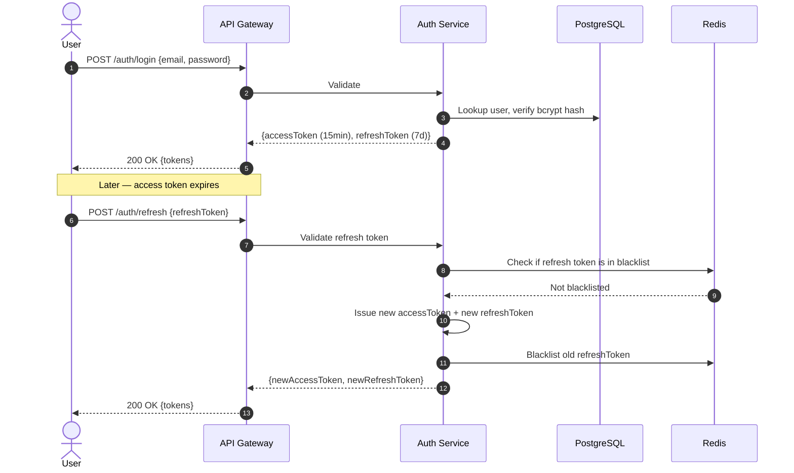

#### Token Configuration

```typescript
// JWT configuration
const JWT_CONFIG = {
  accessToken: {
    secret: process.env.JWT_ACCESS_SECRET,
    expiresIn: '15m',
  },
  refreshToken: {
    secret: process.env.JWT_REFRESH_SECRET,
    expiresIn: '7d',
  },
};
```

### 5.4 Authorization Patterns

Reference: [NestJS Authorization Documentation](https://docs.nestjs.com/security/authorization), [RBAC with Custom Guards in NestJS — OneUptime](https://oneuptime.com/blog/post/2026-01-25-rbac-custom-guards-nestjs/view)

#### RBAC (Role-Based Access Control)

Use for most GateForge modules. See Section 6 for full implementation.

#### ABAC (Attribute-Based Access Control)

Use when access depends on resource attributes, not just user roles:

```typescript
// ABAC: Access based on resource ownership + user attributes
@Injectable()
export class AbacGuard implements CanActivate {
  canActivate(context: ExecutionContext): boolean {
    const request = context.switchToHttp().getRequest();
    const user = request.user;
    const resource = request.resource; // Loaded by interceptor

    // Policy: Users can edit their own posts; admins can edit any
    if (user.role === 'admin') return true;
    if (resource.authorId === user.id) return true;

    throw new ForbiddenException('Access denied');
  }
}
```

#### Deny-by-Default Rule

**Every endpoint is denied by default.** Access is only granted by explicit decorators:

```typescript
// These are the ONLY ways to make an endpoint accessible:
@Public()          // No auth required (login, health check)
@Roles('admin')    // Requires specific role
@Permissions('users:read')  // Requires specific permission
```

### 5.5 API Security

| Concern | Implementation | Configuration |
|---------|---------------|---------------|
| **Rate Limiting** | `@nestjs/throttler` | Global: 100 req/min; Auth endpoints: 5 req/min |
| **CORS** | Explicit origin whitelist | Only `app.gateforge.com` and configured domains |
| **CSP** | `helmet` middleware | `default-src 'self'`; block inline scripts |
| **HTTPS** | TLS at Kubernetes ingress | Redirect HTTP → HTTPS; HSTS max-age 1 year |
| **Request Size Limit** | `body-parser` limit | `app.use(json({ limit: '1mb' }))` |
| **Timeout** | Global timeout interceptor | 30s for API requests; 5min for file uploads |
| **API Versioning** | URI versioning | `/api/v1/...` |

### 5.6 Secrets Management

| Rule | Implementation |
|------|---------------|
| **Never hardcode secrets** | All secrets via environment variables or Kubernetes Secrets |
| **Rotate secrets regularly** | JWT secrets rotated every 90 days |
| **Separate secrets per environment** | Different secrets for dev, staging, production |
| **Audit secret access** | Log all secret reads in production |
| **Use strong entropy** | `crypto.randomBytes(32).toString('hex')` for secret generation |

```yaml
# Kubernetes Secret manifest (values base64 encoded; source from vault in production)
apiVersion: v1
kind: Secret
metadata:
  name: gateforge-secrets
  namespace: gateforge
type: Opaque
data:
  JWT_ACCESS_SECRET: <base64>
  JWT_REFRESH_SECRET: <base64>
  DATABASE_URL: <base64>
  REDIS_URL: <base64>
```

### 5.7 Dependency Vulnerability Scanning

```yaml
# GitHub Actions CI step
- name: Security Audit
  run: |
    # npm built-in audit
    npm audit --audit-level=high --production
    
    # Snyk deep scan (if configured)
    npx snyk test --severity-threshold=high
    
    # License compliance
    npx license-checker --failOn "GPL-3.0;AGPL-3.0"
```

### 5.8 XSS Prevention

| Context | Prevention | Implementation |
|---------|-----------|----------------|
| **React rendering** | Auto-escaping by default | Never use `dangerouslySetInnerHTML` |
| **Rich text** | DOMPurify sanitization | `DOMPurify.sanitize(html, { ALLOWED_TAGS: ['b', 'i', 'a'] })` |
| **URL parameters** | Validate and encode | Use `encodeURIComponent()` |
| **API responses** | Content-Type header | Always set `Content-Type: application/json` |
| **CSP** | Content Security Policy | Block inline scripts via `helmet` |

```typescript
// React: SAFE — auto-escaped
<div>{userInput}</div>

// React: DANGEROUS — XSS risk
<div dangerouslySetInnerHTML={{ __html: userInput }} />

// React: SAFE — sanitized rich text
import DOMPurify from 'dompurify';
<div dangerouslySetInnerHTML={{
  __html: DOMPurify.sanitize(userInput, {
    ALLOWED_TAGS: ['b', 'i', 'em', 'strong', 'a', 'p', 'br'],
    ALLOWED_ATTR: ['href', 'target'],
  })
}} />
```

### 5.9 Security Checklist — Master

Before approving any Blueprint, verify ALL items:

- [ ] **A01**: All endpoints have explicit access control decorators
- [ ] **A01**: IDOR protections in place (ownership checks)
- [ ] **A01**: CORS configured with explicit origins
- [ ] **A02**: Passwords hashed with bcrypt (cost ≥ 12)
- [ ] **A02**: TLS enforced everywhere; HSTS enabled
- [ ] **A02**: No weak crypto algorithms in use
- [ ] **A03**: All inputs validated via class-validator DTOs
- [ ] **A03**: No raw SQL with string interpolation
- [ ] **A03**: ORM parameterized queries only
- [ ] **A04**: Rate limiting on sensitive endpoints
- [ ] **A04**: Account lockout mechanism
- [ ] **A04**: Threat model documented
- [ ] **A05**: `helmet` middleware enabled
- [ ] **A05**: Swagger disabled in production
- [ ] **A05**: No verbose error messages to clients
- [ ] **A06**: `npm audit` in CI pipeline
- [ ] **A06**: Automated dependency updates enabled
- [ ] **A07**: JWT with short TTL (15min access, 7d refresh)
- [ ] **A07**: Refresh token rotation implemented
- [ ] **A07**: MFA for admin accounts
- [ ] **A08**: DTO whitelist mode (`forbidNonWhitelisted: true`)
- [ ] **A08**: Protected branches + signed commits
- [ ] **A09**: Structured auth logging for all attempts
- [ ] **A09**: Prometheus alerts for suspicious patterns
- [ ] **A10**: Outbound URL whitelist
- [ ] **A10**: Cloud metadata endpoint blocked
- [ ] Secrets never in source code or logs
- [ ] All dependencies scanned for vulnerabilities

---

## 6. Technical Consideration Checklist — User Access Rights

### 6.1 RBAC Design Patterns with Role Hierarchy

Reference: [RBAC with Custom Guards in NestJS — OneUptime](https://oneuptime.com/blog/post/2026-01-25-rbac-custom-guards-nestjs/view), [NestJS Authorization — Official Docs](https://docs.nestjs.com/security/authorization)

#### Role Hierarchy

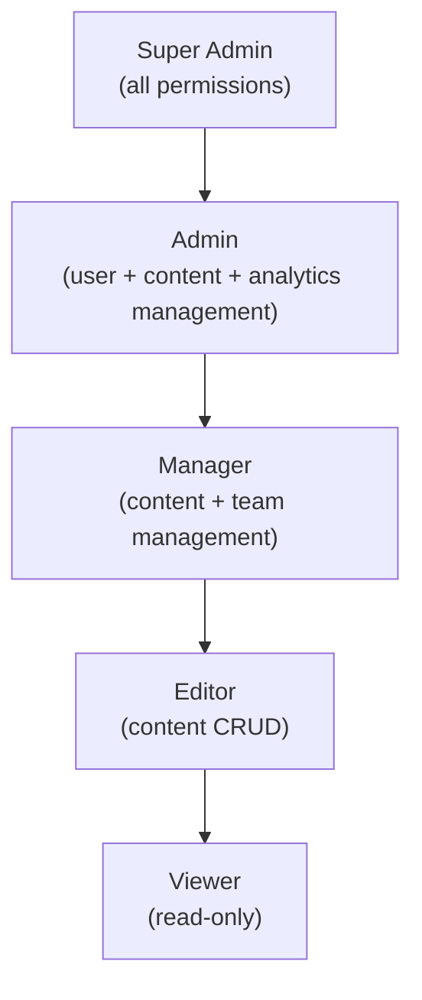

Each role **inherits all permissions from roles below it**.

#### Role Definitions

```typescript
// src/auth/roles.ts
export const ROLES = {
  viewer: {
    name: 'viewer',
    description: 'Read-only access to public content',
    permissions: [
      'content:read',
      'profile:read',
    ],
  },
  editor: {
    name: 'editor',
    description: 'Create and edit content',
    permissions: [
      'content:create',
      'content:read',
      'content:update',
      'comments:create',
      'comments:read',
    ],
    inherits: ['viewer'],
  },
  manager: {
    name: 'manager',
    description: 'Manage content and team members',
    permissions: [
      'content:delete',
      'comments:delete',
      'comments:moderate',
      'team:read',
      'team:manage',
    ],
    inherits: ['editor'],
  },
  admin: {
    name: 'admin',
    description: 'Full admin access',
    permissions: [
      'users:*',
      'analytics:view',
      'analytics:export',
      'settings:manage',
    ],
    inherits: ['manager'],
  },
  super_admin: {
    name: 'super_admin',
    description: 'System-wide unrestricted access',
    permissions: ['system:*'],
    inherits: ['admin'],
  },
} as const;
```

#### Permission Service with Inheritance Resolution

```typescript
// src/auth/permission.service.ts
import { Injectable } from '@nestjs/common';
import { ROLES } from './roles';

@Injectable()
export class PermissionService {
  private cache = new Map<string, Set<string>>();

  getPermissionsForRole(roleName: string): Set<string> {
    if (this.cache.has(roleName)) {
      return this.cache.get(roleName)!;
    }

    const role = ROLES[roleName];
    if (!role) return new Set();

    const permissions = new Set<string>(role.permissions);

    // Resolve inherited permissions recursively
    if (role.inherits) {
      for (const parent of role.inherits) {
        const parentPerms = this.getPermissionsForRole(parent);
        parentPerms.forEach((p) => permissions.add(p));
      }
    }

    this.cache.set(roleName, permissions);
    return permissions;
  }

  hasPermission(userRoles: string[], required: string): boolean {
    for (const role of userRoles) {
      const perms = this.getPermissionsForRole(role);

      // Direct match
      if (perms.has(required)) return true;

      // Wildcard match: "users:*" covers "users:read"
      const [resource] = required.split(':');
      if (perms.has(`${resource}:*`)) return true;

      // System admin wildcard
      if (perms.has('system:*')) return true;
    }
    return false;
  }
}
```

### 6.2 Permission Matrix Template

Use this template to document permissions for each module:

| Resource | Action | Viewer | Editor | Manager | Admin | Super Admin |
|----------|--------|:------:|:------:|:-------:|:-----:|:-----------:|
| **Users** | Create | | | | ✅ | ✅ |
| **Users** | Read | | | | ✅ | ✅ |
| **Users** | Update | | | | ✅ | ✅ |
| **Users** | Delete | | | | ✅ | ✅ |
| **Content** | Create | | ✅ | ✅ | ✅ | ✅ |
| **Content** | Read | ✅ | ✅ | ✅ | ✅ | ✅ |
| **Content** | Update | | ✅ (own) | ✅ | ✅ | ✅ |
| **Content** | Delete | | | ✅ | ✅ | ✅ |
| **Comments** | Create | | ✅ | ✅ | ✅ | ✅ |
| **Comments** | Read | ✅ | ✅ | ✅ | ✅ | ✅ |
| **Comments** | Moderate | | | ✅ | ✅ | ✅ |
| **Comments** | Delete | | | ✅ | ✅ | ✅ |
| **Analytics** | View | | | | ✅ | ✅ |
| **Analytics** | Export | | | | ✅ | ✅ |
| **Settings** | Manage | | | | ✅ | ✅ |
| **System** | All | | | | | ✅ |

**Notation:**
- ✅ = Allowed
- ✅ (own) = Allowed only for resources owned by the user
- Empty = Denied (deny-by-default)

### 6.3 Multi-Tenancy Access Control

#### Tenancy Models

| Model | Description | Isolation Level | Use When |
|-------|-------------|-----------------|----------|
| **Shared Database, Shared Schema** | Single DB, `tenant_id` column on every table | Low (app-enforced) | Cost-sensitive, few tenants |
| **Shared Database, Separate Schema** | Single DB, schema per tenant | Medium (DB-enforced) | Moderate isolation needs |
| **Separate Database per Tenant** | Dedicated DB per tenant | High (infrastructure) | Compliance, high isolation |

**GateForge Recommendation:** Shared Database + Shared Schema + PostgreSQL Row-Level Security (RLS). This provides strong isolation with operational simplicity.

#### NestJS Multi-Tenancy Middleware

```typescript
// src/common/middleware/tenant.middleware.ts
import { Injectable, NestMiddleware, ForbiddenException } from '@nestjs/common';
import { Request, Response, NextFunction } from 'express';
import { DataSource } from 'typeorm';

@Injectable()
export class TenantMiddleware implements NestMiddleware {
  constructor(private readonly dataSource: DataSource) {}

  async use(req: Request, res: Response, next: NextFunction) {
    const tenantId = req.user?.tenantId; // Extracted from JWT

    if (!tenantId) {
      throw new ForbiddenException('No tenant context');
    }

    // Set PostgreSQL session variable for RLS
    await this.dataSource.query(
      `SELECT set_config('app.tenant_id', $1, true)`, // true = local to transaction
      [tenantId],
    );

    next();
  }
}
```

### 6.4 Row-Level Security in PostgreSQL

Reference: [Multi-Tenant Data Isolation with RLS — AWS](https://aws.amazon.com/blogs/database/multi-tenant-data-isolation-with-postgresql-row-level-security/), [Mastering PostgreSQL RLS — Rico Fritzsche](https://ricofritzsche.me/mastering-postgresql-row-level-security-rls-for-rock-solid-multi-tenancy/), [RLS in PostgreSQL — OneUptime](https://oneuptime.com/blog/post/2026-01-25-row-level-security-postgresql/view)

#### Setup

```sql
-- 1. Create the tenant context function
CREATE OR REPLACE FUNCTION current_tenant_id()
RETURNS UUID AS $$
BEGIN
  RETURN NULLIF(current_setting('app.tenant_id', true), '')::UUID;
EXCEPTION
  WHEN OTHERS THEN RETURN NULL;
END;
$$ LANGUAGE plpgsql STABLE;

-- 2. Enable RLS on tenant-scoped tables
ALTER TABLE orders ENABLE ROW LEVEL SECURITY;
ALTER TABLE customers ENABLE ROW LEVEL SECURITY;
ALTER TABLE invoices ENABLE ROW LEVEL SECURITY;

-- 3. Create isolation policies
CREATE POLICY tenant_isolation ON orders
  USING (tenant_id = current_tenant_id())
  WITH CHECK (tenant_id = current_tenant_id());

CREATE POLICY tenant_isolation ON customers
  USING (tenant_id = current_tenant_id())
  WITH CHECK (tenant_id = current_tenant_id());

CREATE POLICY tenant_isolation ON invoices
  USING (tenant_id = current_tenant_id())
  WITH CHECK (tenant_id = current_tenant_id());

-- 4. Create indexes for performance
CREATE INDEX idx_orders_tenant ON orders(tenant_id);
CREATE INDEX idx_customers_tenant ON customers(tenant_id);
CREATE INDEX idx_invoices_tenant ON invoices(tenant_id);

-- 5. Ensure RLS applies even to table owner (optional, for extra safety)
ALTER TABLE orders FORCE ROW LEVEL SECURITY;
ALTER TABLE customers FORCE ROW LEVEL SECURITY;
ALTER TABLE invoices FORCE ROW LEVEL SECURITY;
```

#### Admin Bypass

```sql
-- Create an admin role that can see all tenants (for system operations)
CREATE ROLE system_admin;
ALTER ROLE system_admin BYPASSRLS;

-- OR: Create a policy that allows admin access
CREATE POLICY admin_access ON orders
  FOR ALL
  TO system_admin
  USING (true)
  WITH CHECK (true);
```

#### Testing RLS

```sql
-- Test as Tenant A
SELECT set_config('app.tenant_id', '11111111-1111-1111-1111-111111111111', false);
SELECT * FROM orders; -- Should only see Tenant A's orders

-- Test as Tenant B
SELECT set_config('app.tenant_id', '22222222-2222-2222-2222-222222222222', false);
SELECT * FROM orders; -- Should only see Tenant B's orders

-- Test cross-tenant insert (should fail)
SELECT set_config('app.tenant_id', '11111111-1111-1111-1111-111111111111', false);
INSERT INTO orders (tenant_id, ...) VALUES ('22222222-2222-2222-2222-222222222222', ...);
-- ERROR: new row violates row-level security policy
```

### 6.5 Token-Based Access Control Flow

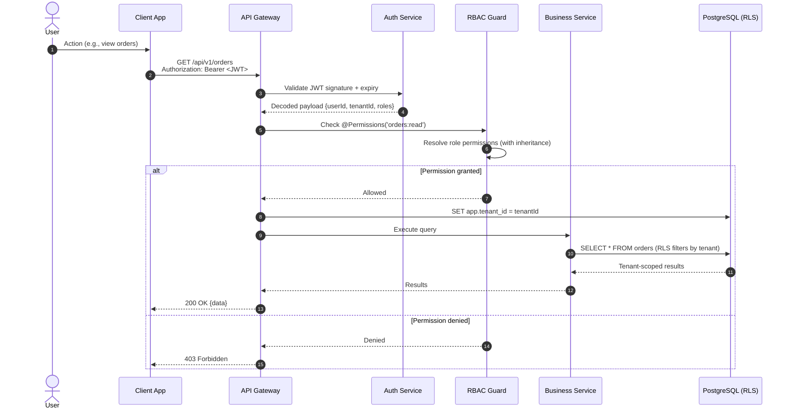

### 6.6 Session Management Best Practices

| Practice | Implementation | Details |
|----------|---------------|---------|
| **Short-lived access tokens** | JWT access token TTL: 15 minutes | Forces frequent re-validation |
| **Refresh token rotation** | Issue new refresh token on each refresh | Old refresh token is blacklisted in Redis |
| **Token blacklisting** | Redis set for revoked tokens | Check on every refresh; auto-expire entries |
| **Concurrent session limit** | Max 3 active sessions per user | Oldest session revoked when exceeded |
| **Device fingerprinting** | Track device + IP in token metadata | Alert on new device login |
| **Idle timeout** | Close session after 30min inactivity | Client-side timer + server validation |
| **Absolute timeout** | Force re-login every 24 hours | Even with active refresh tokens |
| **Secure cookie flags** | `HttpOnly`, `Secure`, `SameSite=Strict` | For cookie-based token storage |

```typescript
// Redis-based token blacklist
@Injectable()
export class TokenBlacklistService {
  constructor(private readonly redis: RedisService) {}

  async blacklist(tokenId: string, expiresInSeconds: number): Promise<void> {
    await this.redis.set(`blacklist:${tokenId}`, '1', 'EX', expiresInSeconds);
  }

  async isBlacklisted(tokenId: string): Promise<boolean> {
    const result = await this.redis.get(`blacklist:${tokenId}`);
    return result !== null;
  }
}
```

### 6.7 Audit Logging for Access Changes

Every access control change MUST be logged with full context:

#### Audit Event Schema

```typescript
// src/common/audit/audit-event.interface.ts
export interface AuditEvent {
  eventId: string;          // UUID
  timestamp: string;        // ISO-8601
  actor: {
    userId: string;
    email: string;
    roles: string[];
    ip: string;
    userAgent: string;
  };
  action: AuditAction;
  resource: {
    type: string;           // 'user' | 'role' | 'permission'
    id: string;
    tenantId: string;
  };
  changes: {
    before: Record<string, any>;
    after: Record<string, any>;
  };
  result: 'success' | 'denied' | 'error';
  metadata?: Record<string, any>;
}

export type AuditAction =
  | 'role.assigned'
  | 'role.revoked'
  | 'permission.granted'
  | 'permission.revoked'
  | 'user.created'
  | 'user.deleted'
  | 'user.locked'
  | 'user.unlocked'
  | 'session.created'
  | 'session.revoked'
  | 'login.success'
  | 'login.failed'
  | 'password.changed'
  | 'mfa.enabled'
  | 'mfa.disabled';
```

#### Audit Service

```typescript
// src/common/audit/audit.service.ts
import { Injectable, Logger } from '@nestjs/common';
import { InjectRepository } from '@nestjs/typeorm';
import { Repository } from 'typeorm';
import { AuditLog } from './audit-log.entity';
import { AuditEvent } from './audit-event.interface';

@Injectable()
export class AuditService {
  private readonly logger = new Logger(AuditService.name);

  constructor(
    @InjectRepository(AuditLog)
    private readonly auditRepo: Repository<AuditLog>,
  ) {}

  async log(event: AuditEvent): Promise<void> {
    // Write to database (append-only table)
    await this.auditRepo.insert({
      eventId: event.eventId,
      timestamp: event.timestamp,
      actorUserId: event.actor.userId,
      actorEmail: event.actor.email,
      actorIp: event.actor.ip,
      action: event.action,
      resourceType: event.resource.type,
      resourceId: event.resource.id,
      tenantId: event.resource.tenantId,
      changesBefore: event.changes.before,
      changesAfter: event.changes.after,
      result: event.result,
    });

    // Also emit to structured logs for Loki/Grafana
    this.logger.log({
      event: 'audit',
      ...event,
    });
  }
}
```

#### Audit Log Table (Append-Only)

```sql
CREATE TABLE audit_logs (
  id BIGSERIAL PRIMARY KEY,
  event_id UUID NOT NULL UNIQUE,
  timestamp TIMESTAMPTZ NOT NULL DEFAULT NOW(),
  actor_user_id UUID NOT NULL,
  actor_email VARCHAR(255) NOT NULL,
  actor_ip INET,
  action VARCHAR(50) NOT NULL,
  resource_type VARCHAR(50) NOT NULL,
  resource_id UUID NOT NULL,
  tenant_id UUID NOT NULL,
  changes_before JSONB,
  changes_after JSONB,
  result VARCHAR(20) NOT NULL,
  metadata JSONB
);

-- Index for common queries
CREATE INDEX idx_audit_timestamp ON audit_logs(timestamp DESC);
CREATE INDEX idx_audit_actor ON audit_logs(actor_user_id, timestamp DESC);
CREATE INDEX idx_audit_resource ON audit_logs(resource_type, resource_id, timestamp DESC);
CREATE INDEX idx_audit_tenant ON audit_logs(tenant_id, timestamp DESC);
CREATE INDEX idx_audit_action ON audit_logs(action, timestamp DESC);

-- Prevent deletion or updates (append-only enforcement)
CREATE RULE no_update_audit AS ON UPDATE TO audit_logs DO INSTEAD NOTHING;
CREATE RULE no_delete_audit AS ON DELETE TO audit_logs DO INSTEAD NOTHING;
```

### 6.8 Access Rights Checklist

- [ ] Role hierarchy defined and documented
- [ ] Permission matrix completed for all modules
- [ ] RBAC guard applied globally with deny-by-default
- [ ] Resource ownership checks for user-scoped resources
- [ ] Multi-tenancy strategy chosen and documented
- [ ] PostgreSQL RLS policies created for all tenant-scoped tables
- [ ] RLS tested with cross-tenant access attempts
- [ ] JWT tokens include `userId`, `tenantId`, `roles`
- [ ] Refresh token rotation and blacklisting implemented
- [ ] Session limits enforced (max concurrent sessions)
- [ ] Audit logging captures all role/permission changes
- [ ] Audit log table is append-only (no UPDATE/DELETE)
- [ ] Admin bypass documented and restricted

---

## 7. Blueprint Comprehensiveness Checklist

Before the Architect declares a Blueprint **"complete"** and distributes work to downstream agents, EVERY item in this checklist must be verified. This ensures the Designer (VM-2), Developers (VM-3), QC (VM-4), and Operator (VM-5) have everything they need.

### 7.1 Requirements Completeness

- [ ] All user stories written in standard format (Section 1.2)
- [ ] Every user story has ≥ 2 acceptance criteria in Given/When/Then format
- [ ] Negative/edge cases defined for every Must-priority story
- [ ] Non-functional requirements specified with measurable thresholds
- [ ] MoSCoW priorities assigned and confirmed by user
- [ ] Requirements Traceability Matrix is up to date
- [ ] Glossary covers all domain-specific terms
- [ ] Ambiguity review complete — no signal words (Section 1.5) remain unresolved

### 7.2 Architecture Completeness

- [ ] System context diagram present (Mermaid)
- [ ] Container/component diagram present (Mermaid)
- [ ] Data flow diagram present (Mermaid)
- [ ] Entity-Relationship diagram present
- [ ] Database schema defined (tables, columns, types, constraints)
- [ ] API contracts defined (endpoints, request/response schemas, status codes)
- [ ] Inter-service communication patterns documented
- [ ] Authentication flow documented with sequence diagram
- [ ] Authorization model documented (roles, permissions matrix)
- [ ] Caching strategy defined (what is cached, TTLs, invalidation)
- [ ] Error handling strategy defined (error codes, retry logic, fallbacks)
- [ ] Circuit breaker configuration documented for all external dependencies

### 7.3 Design Agent (VM-2) Readiness

The Designer needs:

- [ ] Infrastructure requirements (K8s resources, replicas, limits)
- [ ] Database design (schema, indexes, migrations strategy)
- [ ] Security design requirements (authentication, authorization, encryption)
- [ ] Network design (service mesh, ingress, DNS)
- [ ] Monitoring requirements (which metrics, alert thresholds)
- [ ] CI/CD requirements (pipeline stages, quality gates)
- [ ] Rollback strategy for every design component

### 7.4 Developer Agent (VM-3) Readiness

Each developer needs:

- [ ] Clear task assignment (TASK-NNN) with specific module scope
- [ ] API contract for endpoints they implement
- [ ] Database schema for their module
- [ ] Sequence diagrams for complex flows
- [ ] Acceptance criteria mapped to their code deliverables
- [ ] Dependencies on other modules/tasks are identified
- [ ] Coding standards (ESLint config, Prettier, conventional commits)
- [ ] Environment setup instructions (`.env.example`, Docker Compose)

### 7.5 QC Agent (VM-4) Readiness

QC needs:

- [ ] Acceptance criteria are testable and unambiguous
- [ ] Test case mapping: every AC has a corresponding TC-NNN identifier
- [ ] Test environment requirements specified
- [ ] Test data requirements specified
- [ ] Quality gate thresholds defined:
  - P0: 100% pass rate
  - P1: 95% pass rate
  - P2: 80% pass rate
- [ ] Performance testing criteria specified (latency, throughput)
- [ ] Security testing scope defined (which OWASP items to test)

### 7.6 Operator Agent (VM-5) Readiness

Operator needs:

- [ ] Deployment target environment documented
- [ ] Docker image naming convention defined
- [ ] Kubernetes manifests or Helm chart requirements specified
- [ ] Environment variables list with descriptions (no actual secrets)
- [ ] Health check endpoints defined
- [ ] Monitoring and alerting rules specified
- [ ] Rollback procedure documented
- [ ] Database migration strategy documented
- [ ] CI/CD pipeline stages defined
- [ ] Release process: Git tag → Build → UAT → Go/No-Go → Production

### 7.7 Cross-Cutting Concerns

- [ ] Logging strategy: structured JSON, correlation IDs, log levels
- [ ] Monitoring: Prometheus metrics defined for all services
- [ ] Alerting: Grafana/Prometheus alert rules for critical paths
- [ ] Security: OWASP Top 10 checklist completed (Section 5)
- [ ] Access control: RBAC permissions matrix completed (Section 6)
- [ ] Circuit breakers: configured for all external dependencies (Section 3)
- [ ] CQRS: decision matrix applied where relevant (Section 4)
- [ ] Rollback: every deployable component has rollback strategy

### 7.8 Documentation Quality

- [ ] `blueprint.md` version is current and consistent
- [ ] `architecture.md` matches the Blueprint requirements
- [ ] `status.md` reflects actual current state
- [ ] `decision-log.md` has entries for all major decisions
- [ ] All diagrams are in Mermaid syntax and render correctly
- [ ] No TODO, FIXME, or TBD items remain in any document
- [ ] All cross-references between documents are valid
- [ ] Git commit history is clean with descriptive messages

### 7.9 Final Sign-Off Checklist

```json
{
  "blueprintVersion": "x.y.z",
  "signOff": {
    "requirementsComplete": true,
    "architectureComplete": true,
    "designerReady": true,
    "developerReady": true,
    "qcReady": true,
    "operatorReady": true,
    "securityReviewed": true,
    "rollbackDefined": true,
    "humanApproval": "pending"
  },
  "qualityGate": "Design Review",
  "nextStep": "Dispatch to @designer (VM-2)",
  "decisionLogRef": "DEC-NNN"
}
```

The Architect sends this sign-off payload to the human user via Telegram for final Go/No-Go before dispatching to downstream agents.

---

## 8. Project Management & Progress Tracking

The System Architect is not only the technical coordinator — it is the **project manager** of the entire GateForge pipeline. The end-user must be able to ask at any moment "What is the current progress?" and receive a precise, structured answer covering what is done, what is in progress, what is planned, and what is blocked.

This section defines the backlog structure, iteration cycle, release planning, and bug/enhancement logging mechanism that the Architect must maintain at all times.

---

### 8.1 Backlog Management

#### 8.1.1 Backlog Hierarchy

For any non-trivial application, the backlog must be organised into a **two-level hierarchy**: a global project backlog and per-module backlogs.

```
Project Backlog (backlog.md)
├── Module: auth
│   ├── TASK-001 [P0] [Must] Implement JWT login .............. ✅ Done
│   ├── TASK-002 [P0] [Must] Refresh token rotation ........... 🔄 In Progress
│   ├── BUG-001  [P1] Token expiry not enforced on logout ..... 📋 Backlog
│   └── ENH-001  [P2] Add biometric login for mobile .......... 📋 Backlog
│
├── Module: patient-records
│   ├── TASK-010 [P0] [Must] CRUD patient demographics ........ 🔄 In Progress
│   ├── TASK-011 [P1] [Should] Bulk import from CSV ........... 📋 Backlog
│   └── BUG-002  [P0] Duplicate patient ID on concurrent write  📋 Backlog
│
├── Module: billing
│   └── (not yet decomposed — Phase 2)
│
└── Infrastructure
    ├── TASK-050 [P0] [Must] K8s namespace setup .............. ✅ Done
    └── TASK-051 [P1] [Should] Prometheus alerting rules ....... 📋 Backlog
```

#### 8.1.2 Backlog Item Schema

Every backlog item (task, bug, or enhancement) must follow this schema:

```json
{
  "id": "TASK-001 | BUG-001 | ENH-001",
  "type": "feature | bug | enhancement | infrastructure | tech-debt",
  "module": "auth | patient-records | billing | infrastructure | global",
  "title": "Short descriptive title",
  "description": "Detailed description with context",
  "priority": "P0 | P1 | P2 | P3",
  "moscow": "Must | Should | Could | Won't",
  "status": "backlog | ready | in-progress | in-review | testing | done | blocked",
  "assignedTo": "dev-01 | dev-02 | designer | qc-01 | operator | unassigned",
  "iteration": "ITER-001 | backlog",
  "storyPoints": "1 | 2 | 3 | 5 | 8 | 13",
  "acceptanceCriteria": ["AC-1", "AC-2"],
  "dependencies": ["TASK-000"],
  "blueprintRef": "blueprint.md#section",
  "createdDate": "2026-04-07",
  "updatedDate": "2026-04-07",
  "completedDate": null,
  "reportedBy": "tony | architect | qc-01 | dev-01",
  "notes": "Additional context or history"
}
```

#### 8.1.3 Priority Definitions

| Priority | Label | SLA | Description |
|----------|-------|-----|-------------|
| **P0** | Critical | Immediate | System down, data loss risk, security vulnerability, blocker for other tasks |
| **P1** | High | Within current iteration | Core functionality, major bug, significant user impact |
| **P2** | Medium | Within next 2 iterations | Important but not blocking, minor bug, quality improvement |
| **P3** | Low | Planned for future | Nice-to-have, cosmetic, optimisation, tech debt |

#### 8.1.4 Status Workflow

Every backlog item follows this state machine:

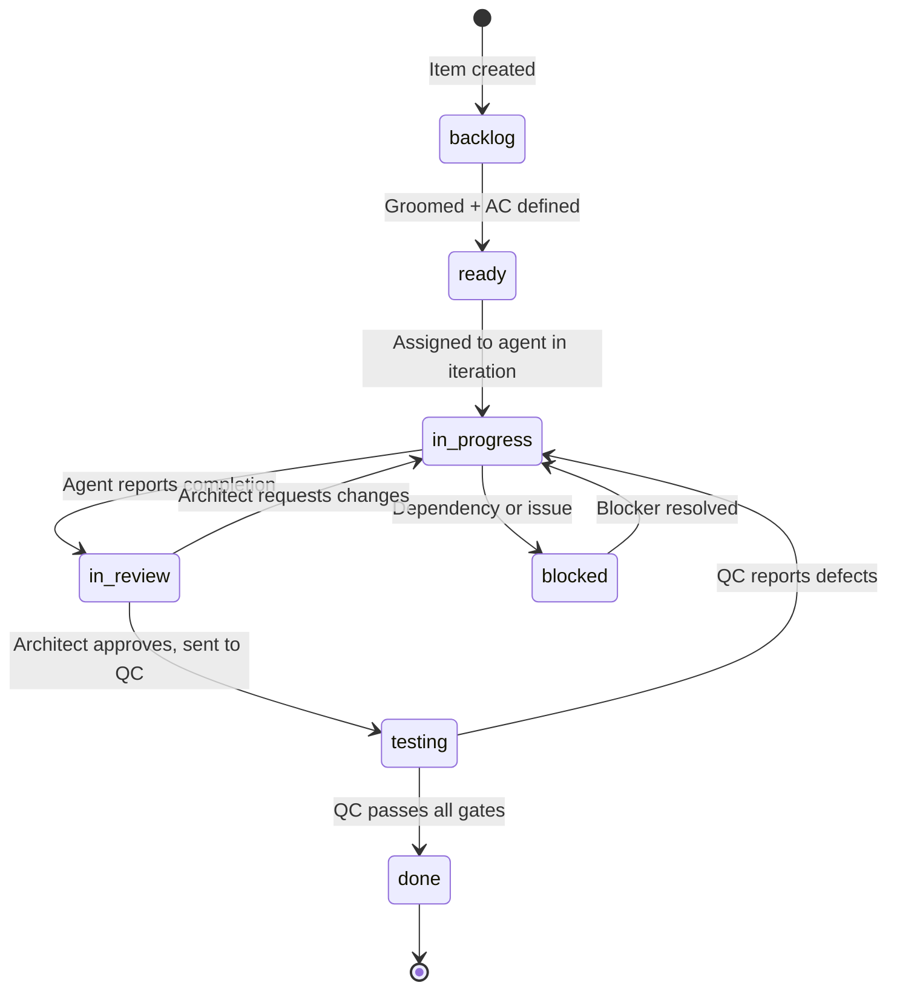

#### 8.1.5 Backlog File Structure

Maintain these files in the Blueprint repository:

```
blueprint-repo/
├── backlog.md                      ← Master backlog (all items, all modules)
├── backlog/
│   ├── auth.md                     ← Module-level backlog: auth
│   ├── patient-records.md          ← Module-level backlog: patient-records
│   ├── billing.md                  ← Module-level backlog: billing
│   ├── infrastructure.md           ← Infrastructure backlog
│   └── tech-debt.md                ← Tech debt backlog
├── iterations/
│   ├── ITER-001.md                 ← Iteration plan + retrospective
│   ├── ITER-002.md
│   └── ...
└── releases/
    ├── RELEASE-v1.0.0.md           ← Release plan + notes
    └── ...
```

#### 8.1.6 Backlog Grooming Rules

The Architect must groom the backlog before every iteration:

- [ ] All items have complete acceptance criteria
- [ ] All items are prioritised (P0/P1/P2/P3)
- [ ] All items have story point estimates
- [ ] Dependencies between items are identified
- [ ] Blocked items have documented blockers and resolution plan
- [ ] Items without module assignment are categorised
- [ ] Stale items (no update for 2+ iterations) are reviewed and either re-prioritised or removed

---

### 8.2 Iteration Cycle

#### 8.2.1 Iteration Structure

GateForge uses fixed-length iteration cycles. Each iteration follows this structure:

| Phase | Duration | Activities |
|-------|----------|------------|
| **Planning** | Day 1 | Architect selects items from backlog, assigns to agents, defines iteration goal |
| **Execution** | Days 2–N | Agents work on assigned tasks in parallel |
| **Review** | Day N+1 | Architect reviews all deliverables, QC validates |
| **Retrospective** | Day N+1 | Record what worked, what did not, what to improve |

Iteration length is flexible based on project phase:
- **Early phase** (architecture + initial modules): 1-week iterations
- **Active development**: 2-week iterations
- **Stabilisation / pre-release**: 1-week iterations

#### 8.2.2 Iteration Plan Template

Maintain each iteration in `iterations/ITER-NNN.md`:

```markdown
# Iteration ITER-001 — [Iteration Goal Title]

| Field | Value |
|-------|-------|
| **Start Date** | 2026-04-07 |
| **End Date** | 2026-04-21 |
| **Goal** | Deliver auth module + patient-records CRUD |
| **Total Story Points** | 34 |
| **Status** | In Progress | Planning | Completed |

## Committed Items

| ID | Module | Title | Priority | Points | Assigned | Status |
|----|--------|-------|----------|--------|----------|--------|
| TASK-001 | auth | JWT login | P0 | 5 | dev-01 | ✅ Done |
| TASK-002 | auth | Refresh token | P0 | 3 | dev-01 | 🔄 In Progress |
| TASK-010 | patient | CRUD demographics | P0 | 8 | dev-02 | 🔄 In Progress |
| TASK-050 | infra | K8s namespace | P0 | 5 | designer | ✅ Done |
| TASK-060 | auth | Unit + integration tests | P0 | 5 | qc-01 | 📋 Pending |

## Velocity

| Metric | Value |
|--------|-------|
| Points Committed | 34 |
| Points Completed | 10 |
| Points Remaining | 24 |
| Completion Rate | 29% |

## Blockers

| ID | Blocker | Impact | Resolution |
|----|---------|--------|------------|
| TASK-002 | Waiting for Redis cluster design from Designer | Blocks token storage | ETA: Day 3 |

## Retrospective (filled at iteration end)

### What Went Well
- (filled after iteration completes)

### What Needs Improvement
- (filled after iteration completes)

### Action Items for Next Iteration
- (filled after iteration completes)
```

#### 8.2.3 Iteration Execution Rules

1. **No scope creep** — Once planning is done, no new items enter the iteration unless P0 critical (in which case, an equivalent item is deferred)
2. **Daily status check** — The Architect polls or receives reports from all active agents and updates `status.md` and the iteration plan
3. **Blocked escalation** — If a task is blocked for more than 1 day, the Architect must either resolve the dependency or swap the task out
4. **Velocity tracking** — Record completed story points per iteration to forecast future iterations
5. **Carry-over** — Incomplete items carry over to the next iteration with a note explaining why

---

### 8.3 Release Planning

#### 8.3.1 Release Plan Template

Maintain each release in `releases/RELEASE-vX.Y.Z.md`:

```markdown
# Release v1.0.0 — [Release Name]

| Field | Value |
|-------|-------|
| **Target Date** | 2026-05-01 |
| **Status** | Planning | In Progress | UAT | Released |
| **Iterations Included** | ITER-001, ITER-002, ITER-003 |
| **Release Manager** | System Architect |

## Release Scope

### Modules Included

| Module | Features Included | Status |
|--------|-------------------|--------|
| auth | JWT login, refresh tokens, RBAC | ✅ Complete |
| patient-records | CRUD, search, bulk import | 🔄 In Progress |
| infrastructure | K8s setup, monitoring, CI/CD | ✅ Complete |

### Backlog Items in This Release

| ID | Module | Title | Priority | Status |
|----|--------|-------|----------|--------|
| TASK-001 | auth | JWT login | P0 | ✅ Done |
| TASK-002 | auth | Refresh token | P0 | ✅ Done |
| TASK-010 | patient | CRUD demographics | P0 | ✅ Done |
| TASK-011 | patient | Bulk import CSV | P1 | 🔄 In Progress |

### Known Issues (shipping with this release)

| ID | Module | Severity | Description | Workaround |
|----|--------|----------|-------------|------------|
| BUG-003 | patient | Minor | Search slow on >10k records | Pagination limits |

## Quality Gate Summary

| Gate | Status | Details |
|------|--------|---------|
| Unit Tests | ✅ Pass | 97% coverage |
| Integration Tests | ✅ Pass | 92% coverage |
| E2E Tests | ✅ Pass | 88% coverage |
| Security Scan | ✅ Pass | 0 critical, 0 high |
| Performance Test | ⚠️ Warning | p95 latency 480ms (target 500ms) |

## Deployment Plan

| Step | Target | Date | Owner |
|------|--------|------|-------|
| Deploy to Dev | US VM (Dev) | 2026-04-25 | Operator |
| QA Validation | US VM (Dev) | 2026-04-26 | QC agents |
| Deploy to UAT | US VM (UAT) | 2026-04-27 | Operator |
| UAT Sign-off | — | 2026-04-28 | the end-user |
| Deploy to Prod | US VM (Prod) | 2026-05-01 | Operator |

## Rollback Plan

- Docker image tag: v0.9.0 (previous release)
- Database: down migration script tested
- Procedure: See deployment-runbook-v1.0.0.md
```

#### 8.3.2 Semantic Versioning Rules

| Change Type | Version Bump | Example |
|-------------|-------------|----------|
| Breaking API change | Major (X.0.0) | Removed endpoint, changed auth scheme |
| New feature, backward-compatible | Minor (0.X.0) | New module, new endpoint |
| Bug fix, patch | Patch (0.0.X) | Fix login error, correct validation |
| Hotfix (production) | Patch (0.0.X) | Emergency security patch |

#### 8.3.3 Release Readiness Checklist

- [ ] All committed backlog items are Done or explicitly deferred with rationale
- [ ] All quality gates pass (unit ≥ 95%, integration ≥ 90%, E2E ≥ 85%)
- [ ] No open P0 or P1 bugs
- [ ] P2 bugs documented in Known Issues if shipping
- [ ] Release notes generated with feature list + bug fixes
- [ ] Deployment runbook reviewed and tested
- [ ] Rollback procedure tested
- [ ] the end-user's Go/No-Go approval obtained via Telegram

---

### 8.4 Bug & Enhancement Logging

This is the mechanism for the end-user (or any agent) to report bugs and request enhancements. The Architect must be able to receive, classify, and track these alongside the regular backlog.

#### 8.4.1 Bug Report Schema

```json
{
  "id": "BUG-NNN",
  "type": "bug",
  "module": "auth | patient-records | billing | infrastructure | global",
  "title": "Short description of the bug",
  "severity": "critical | major | minor | cosmetic",
  "priority": "P0 | P1 | P2 | P3",
  "status": "reported | confirmed | in-progress | fixed | verified | closed | wont-fix",
  "reportedBy": "tony | qc-01 | qc-02 | dev-01 | architect",
  "reportedDate": "2026-04-07",
  "assignedTo": "dev-01 | unassigned",
  "environment": "dev | uat | production",
  "stepsToReproduce": [
    "Step 1: Navigate to login page",
    "Step 2: Enter valid credentials",
    "Step 3: Click submit",
    "Step 4: Observe error 500 in response"
  ],
  "expectedBehaviour": "User receives JWT token and is redirected to dashboard",
  "actualBehaviour": "Server returns 500 Internal Server Error",
  "rootCause": "(filled after investigation) Redis connection timeout — sentinel failover not configured",
  "fix": "(filled after fix) Added Redis Sentinel config with 3-node cluster",
  "relatedTasks": ["TASK-002"],
  "iteration": "ITER-002 | backlog",
  "resolvedDate": null,
  "verifiedBy": null
}
```

#### 8.4.2 Bug Severity Matrix

| Severity | Definition | Response Time | Examples |
|----------|-----------|---------------|----------|
| **Critical** | System unusable, data loss, security breach | Immediate (hotfix) | Login broken for all users, data corruption, credentials exposed |
| **Major** | Core feature broken, significant user impact | Current iteration | Payment fails intermittently, patient record not saving, wrong data displayed |
| **Minor** | Feature works but with issues, workaround exists | Next iteration | Slow search, incorrect date format, minor UI misalignment |
| **Cosmetic** | Visual or text issue, no functional impact | Backlog | Typo in label, icon misaligned, colour inconsistency |

#### 8.4.3 Bug Status Workflow

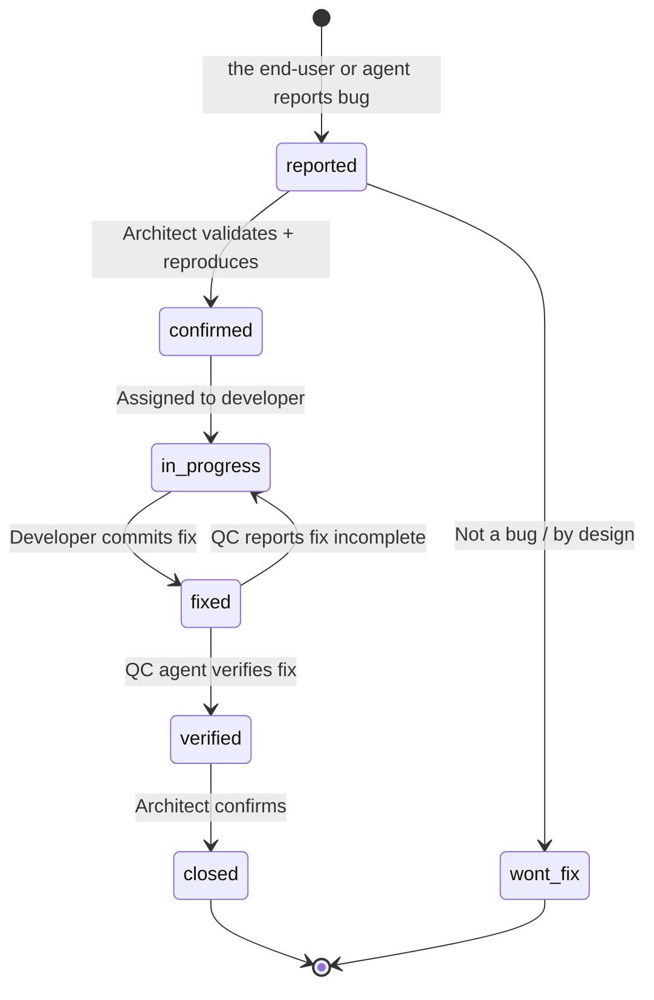

#### 8.4.4 Enhancement Request Schema

```json
{
  "id": "ENH-NNN",
  "type": "enhancement",
  "module": "auth | patient-records | billing | infrastructure | global",
  "title": "Short description of the enhancement",
  "description": "Detailed description with business justification",
  "priority": "P0 | P1 | P2 | P3",
  "moscow": "Must | Should | Could | Won't",
  "status": "proposed | approved | backlog | in-progress | done | deferred | rejected",
  "requestedBy": "tony | architect",
  "requestedDate": "2026-04-07",
  "targetRelease": "v1.1.0 | unplanned",
  "estimatedPoints": "5",
  "businessValue": "High | Medium | Low",
  "technicalComplexity": "S | M | L | XL",
  "acceptanceCriteria": ["AC-1", "AC-2"],
  "notes": "Additional context from the end-user"
}
```

#### 8.4.5 Enhancement Status Workflow

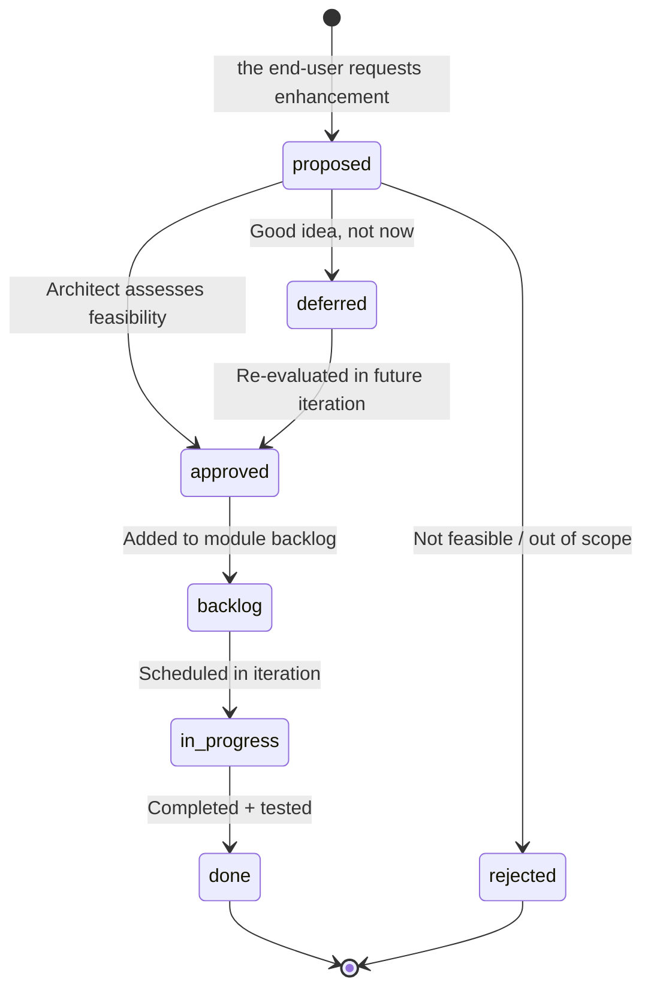

#### 8.4.6 Module-Level Bug & Enhancement Log

Maintain a log file per module in the backlog directory:

```markdown
# Bug & Enhancement Log — Module: auth

## Open Bugs

| ID | Severity | Priority | Title | Status | Assigned | Reported |
|----|----------|----------|-------|--------|----------|----------|
| BUG-001 | Major | P1 | Token expiry not enforced on logout | confirmed | dev-01 | 2026-04-07 |
| BUG-004 | Minor | P2 | Rate limit counter not reset after window | reported | unassigned | 2026-04-08 |

## Closed Bugs

| ID | Severity | Title | Fixed By | Verified By | Closed Date |
|----|----------|-------|----------|-------------|-------------|
| BUG-003 | Critical | SQL injection in login query | dev-01 | qc-01 | 2026-04-06 |

## Open Enhancements

| ID | Priority | Title | Status | Target Release | Points |
|----|----------|-------|--------|----------------|--------|
| ENH-001 | P2 | Biometric login for mobile | approved | v1.1.0 | 8 |
| ENH-005 | P3 | Social login (Google, Apple) | proposed | unplanned | 13 |

## Completed Enhancements

| ID | Title | Completed | Release |
|----|-------|-----------|---------|
| ENH-002 | Password strength indicator | 2026-04-10 | v1.0.0 |
```

---

### 8.5 Progress Reporting

The Architect must be able to answer the end-user's status inquiries instantly. Maintain these living documents and structured responses.

#### 8.5.1 Status Inquiry Response Template

When the end-user asks "What is the current progress?" via Telegram, respond with this structure:

```
📊 GateForge Progress Report — [Date]

🎯 Current Iteration: ITER-002 (Day 5 of 14)
   Goal: Deliver auth module + patient-records CRUD
   Velocity: 18/34 points (53% complete)

📦 Module Status:
   ✅ auth         — 4/5 tasks done, 1 in QA
   🔄 patient      — 2/4 tasks in progress
   📋 billing      — Not started (ITER-003)
   ✅ infra        — Complete

🐛 Open Bugs: 3 total
   P0: 0 | P1: 1 (BUG-001 auth) | P2: 2

✨ Open Enhancements: 4 total
   Approved: 1 | Proposed: 3

🚧 Blockers: 1
   TASK-012 blocked by Redis cluster design (ETA: tomorrow)

📅 Next Release: v1.0.0 — Target: 2026-05-01
   Readiness: 60% (auth done, patient in progress, billing not started)

🔮 Upcoming:
   Next iteration: ITER-003 — billing module + E2E tests
```

#### 8.5.2 Status Files to Maintain

| File | Update Frequency | Content |
|------|-----------------|----------|
| `status.md` | After every agent report | Current state of all active tasks |
| `backlog.md` | After every planning session | Master backlog with all items |
| `backlog/<module>.md` | When module items change | Per-module backlog + bug/enhancement log |
| `iterations/ITER-NNN.md` | Daily during iteration | Iteration plan, progress, velocity |
| `releases/RELEASE-vX.Y.Z.md` | As release approaches | Release scope, quality gates, deployment plan |
| `decision-log.md` | After every decision | Append-only decision record |

#### 8.5.3 Progress Tracking Metrics

Track and report these metrics per iteration:

| Metric | Formula | Target |
|--------|---------|--------|
| **Velocity** | Story points completed per iteration | Stable or increasing |
| **Burn-down** | Remaining points over iteration days | Linear decline |
| **Bug Escape Rate** | Bugs found in UAT or Prod / total items delivered | < 5% |
| **Defect Density** | Bugs per module / story points delivered in module | < 0.3 |
| **Carry-over Rate** | Items carried to next iteration / items committed | < 15% |
| **Block Rate** | Days blocked / total iteration days | < 10% |
| **QA Pass Rate** | Tests passed on first run / total tests | > 90% |

#### 8.5.4 Automated Status Update Protocol

After receiving a structured report from any agent, the Architect must:

1. Parse the report and update the corresponding backlog item status
2. Update `status.md` with the new state
3. Update the current iteration plan (`iterations/ITER-NNN.md`)
4. If a bug is reported, create a `BUG-NNN` entry in the module's backlog file
5. If all items for a module are complete, mark the module as ready for QA
6. If all QA gates pass for a release scope, prepare the release plan
7. Commit all changes to Git with descriptive message: `chore(status): update ITER-002 — TASK-010 completed by dev-02`

---

### 8.6 Quick Commands for the end-user

The Architect must recognise and respond to these quick commands from the end-user via Telegram:

| Command (natural language) | Action |
|---------------------------|--------|
| "What is the progress?" | Generate full progress report (8.5.1 template) |
| "Status of [module]" | Show module-specific backlog, bugs, and iteration items |
| "Show backlog" | List all backlog items grouped by module and priority |
| "Show bugs" | List all open bugs by severity and module |
| "Show enhancements" | List all open enhancements by priority and module |
| "Log bug: [description]" | Create a new BUG-NNN entry, classify, and add to module backlog |
| "Log enhancement: [description]" | Create a new ENH-NNN entry, classify, and add to module backlog |
| "What is planned next?" | Show the next iteration plan or upcoming release scope |
| "Release status" | Show current release readiness with quality gate summary |
| "Iteration velocity" | Show velocity trend across recent iterations |

The Architect must parse the end-user's intent even when the phrasing is informal. For example, "how's auth going?" should trigger the module status for the auth module.

---

## Appendix A: Quick Reference — Structured JSON Payloads

### Task Delegation Payload

```json
{
  "taskId": "TASK-001",
  "type": "implementation",
  "priority": "P0",
  "module": "auth",
  "description": "Implement JWT login endpoint with bcrypt password verification",
  "acceptanceCriteria": [
    "POST /api/v1/auth/login accepts {email, password}",
    "Returns {accessToken, refreshToken} on success",
    "Returns 401 on invalid credentials (no user enumeration)",
    "Account locks after 5 failed attempts in 15 minutes",
    "Rate limited to 5 requests/minute per IP"
  ],
  "blueprintRef": "blueprint.md#us-auth-001",
  "deadline": "2026-04-10T00:00:00Z",
  "dependencies": []
}
```

### Agent Report Payload

```json
{
  "taskId": "TASK-001",
  "agentId": "dev-01",
  "status": "completed",
  "deliverables": [
    "src/modules/auth/auth.controller.ts",
    "src/modules/auth/auth.service.ts",
    "src/modules/auth/strategies/jwt.strategy.ts"
  ],
  "testResults": {
    "unit": { "passed": 12, "failed": 0, "skipped": 0 },
    "integration": { "passed": 5, "failed": 0, "skipped": 0 }
  },
  "notes": "Used bcrypt with cost factor 12. Rate limiting via @nestjs/throttler.",
  "commitHash": "abc1234",
  "timestamp": "2026-04-08T14:30:00Z"
}
```

---

## Appendix B: Cross-References to GateForge Documents

| Document | Location | Purpose |
|----------|----------|---------|
| SOUL.md | `openclaw-configs/vm-1-architect/SOUL.md` | Agent core configuration and behavioral rules |
| BLUEPRINT-GUIDE.md | `openclaw-configs/vm-1-architect/BLUEPRINT-GUIDE.md` | This document — requirements and architecture standards |
| Designer SOUL | `openclaw-configs/vm-2-designer/SOUL.md` | System Designer agent configuration |
| Developer SOUL | `openclaw-configs/vm-3-dev/SOUL.md` | Developer agent configuration |
| QC SOUL | `openclaw-configs/vm-4-qc/SOUL.md` | Quality Control agent configuration |
| Operator SOUL | `openclaw-configs/vm-5-operator/SOUL.md` | Deployment Operator agent configuration |
| Lobster SDLC Pipeline | `workflows/gateforge-sdlc.lobster` | Full requirement-to-deployment pipeline |
| Code Review Pipeline | `workflows/code-review.lobster` | Code → test → fix iteration loop |

---

---

## Appendix C: Managed Output Documents

The System Architect is responsible for creating and maintaining the following documents in the Blueprint repository. When The end-user provides requirements, the Architect must systematically produce this document set.

### Document Ownership Map

| Document | Path in Blueprint Repo | When to Create | When to Update |
|----------|----------------------|----------------|----------------|
| User Requirements | `requirements/user-requirements.md` | When The end-user provides initial requirements | When the end-user adds/changes requirements |
| Functional Requirements | `requirements/functional-requirements.md` | After user requirements are captured | When FRs are decomposed, refined, or added |
| Non-Functional Requirements | `requirements/non-functional-requirements.md` | During initial architecture phase | When performance/security/scalability targets change |
| Technical Architecture | `architecture/technical-architecture.md` | After requirements are stable | When architecture decisions change |
| Data Model | `architecture/data-model.md` | During architecture phase | When entities or relationships change |
| API Specifications | `architecture/api-specifications/<service>.openapi.yaml` | When a new service is designed | When API contracts change |
| Master Backlog | `project/backlog.md` | At project start | After every planning session |
| Module Backlogs | `project/backlog/<module>.md` | When a module is created | When module items change |
| Iteration Plans | `project/iterations/ITER-<NNN>.md` | At iteration planning | Daily during iteration |
| Release Plans | `project/releases/RELEASE-v<X.Y.Z>.md` | When release scope is defined | As release approaches |
| Decision Log | `project/decision-log.md` | At first decision | After every decision (append-only) |
| Status | `project/status.md` | At project start | After every agent report |
| Changelog | `CHANGELOG.md` | At project start | After every release |

### Requirement Transformation Workflow

When The end-user provides requirements via Telegram, follow this sequence:

```
Step 1: Capture raw input → requirements/user-requirements.md
          (user stories, personas, workflow diagrams)

Step 2: Decompose → requirements/functional-requirements.md
          (module mapping, FR table, traceability matrix)

Step 3: Define quality → requirements/non-functional-requirements.md
          (performance targets, security, scalability, availability)

Step 4: Architect → architecture/technical-architecture.md
          (C4 diagrams, tech stack, communication patterns)

Step 5: Data model → architecture/data-model.md
          (ER diagram, schema, Redis model)

Step 6: API contracts → architecture/api-specifications/
          (OpenAPI 3.0 per service)

Step 7: Plan → project/backlog.md + project/iterations/ITER-001.md
          (decomposed tasks, iteration planning)

Step 8: Dispatch → Design tasks to VM-2, Dev tasks to VM-3
          (using Lobster pipeline)
```

### Document Templates

All templates are in the `gateforge-blueprint-template` repository (`tonylnng/gateforge-blueprint-template`). This template repo is **read-only** — no agent writes to it. When starting a new project:

1. Clone the template repo into a new project-specific Blueprint repo (e.g. `tonylnng/<project>-blueprint`)
2. Fill in requirements (Steps 1-3)
3. Fill in architecture (Steps 4-6)
4. Create backlog and first iteration plan (Step 7)
5. Dispatch to specialist agents (Step 8)

To pull future template updates into an existing project Blueprint:

```bash
cd ~/workspace/<project>-blueprint
git remote add template https://github.com/tonylnng/gateforge-blueprint-template.git  # one-time
git pull template main --allow-unrelated-histories
# Resolve any merge conflicts, then commit
```

This ensures all project Blueprints receive the latest standards and fine-tuned content from the template.

### Git Commit Conventions for Blueprint Updates

| Change Type | Commit Format | Example |
|-------------|---------------|----------|
| Requirements | `docs(req): <description>` | `docs(req): add patient-records user stories` |
| Architecture | `docs(arch): <description>` | `docs(arch): add C4 container diagram` |
| Backlog | `chore(backlog): <description>` | `chore(backlog): add billing module tasks` |
| Iteration | `chore(iter): <description>` | `chore(iter): update ITER-002 day 5 status` |
| Decision | `docs(adr): <description>` | `docs(adr): decide on PostgreSQL over MongoDB` |
| Status | `chore(status): <description>` | `chore(status): TASK-010 completed by dev-02` |
| Release | `docs(release): <description>` | `docs(release): prepare v1.0.0 release plan` |

---

*This document is the authoritative reference for the GateForge System Architect agent (VM-1). It is maintained by the end-user and versioned alongside the agent's SOUL configuration. All architectural decisions, requirements processes, and quality standards defined herein are binding on the multi-agent SDLC pipeline.*
