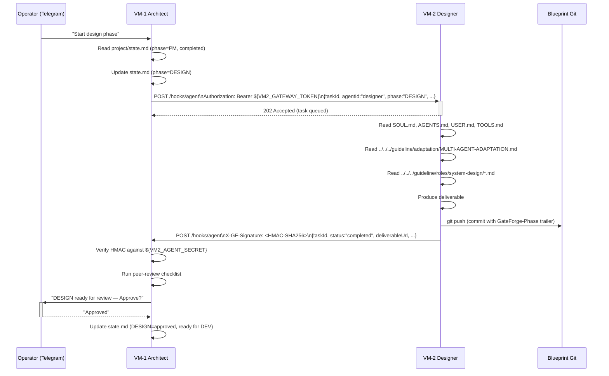
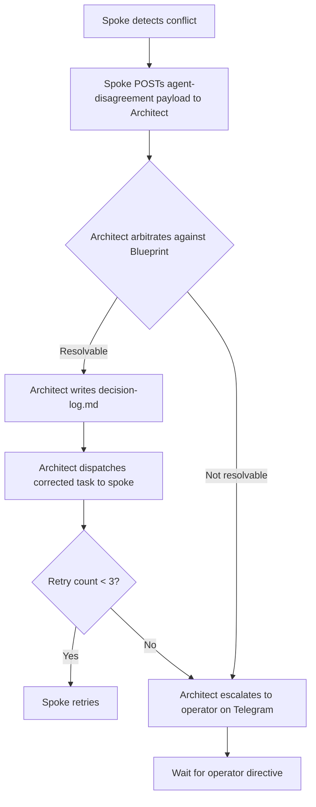

# Multi-Agent Adaptation

> **Class B — Methodology adapter.** This file describes how the multi-agent variant ([`variants/multi-agent/`](../../variants/multi-agent/)) executes the methodology in [`guideline/`](../). Read this file together with the active role guide whenever the agent's variant is multi-agent.

---

## 1. Topology — One Picture

```
                          ┌──────────────────────────┐
                          │   Operator (Telegram)    │
                          └────────────┬─────────────┘
                                       │ commands + Approvals
                                       ▼
        ┌──────────────────────────────────────────────────────────────────┐
        │  VM-1  SYSTEM ARCHITECT  (HUB)                                   │
        │  Claude Opus 4.6                                                  │
        │  tonic-architect.sailfish-bass.ts.net : 18789                     │
        │                                                                   │
        │  • Owns the Blueprint (writes)                                    │
        │  • Dispatches tasks to spokes                                     │
        │  • Receives HMAC-signed callbacks                                 │
        │  • Runs peer-review at every quality gate                         │
        └────┬───────────────┬───────────────┬───────────────┬──────────────┘
             │HTTPS+Bearer   │HTTPS+Bearer   │HTTPS+Bearer   │HTTPS+Bearer
             │+JSON          │+JSON          │+JSON          │+JSON
             ▼               ▼               ▼               ▼
       ┌──────────┐    ┌──────────┐    ┌──────────┐    ┌──────────┐
       │  VM-2    │    │  VM-3    │    │  VM-4    │    │  VM-5    │
       │ Designer │    │ Devs     │    │ QC pool  │    │ Operator │
       │ Sonnet   │    │ Sonnet   │    │ MiniMax  │    │ MiniMax  │
       │  4.6     │    │  4.6     │    │   2.7    │    │   2.7    │
       │          │    │ dev-01   │    │  qc-01   │    │          │
       │          │    │ dev-02   │    │  qc-02   │    │          │
       └────┬─────┘    └────┬─────┘    └────┬─────┘    └────┬─────┘
            │               │               │               │
            │  HMAC-SHA256 callback to architect on every commit
            └───────────────┴───────────────┴───────────────┘
                                  │
                                  ▼
                    ┌────────────────────────────┐
                    │  Shared Blueprint Git Repo │
                    │  (read by all VMs,         │
                    │   written by VM-1 only)    │
                    └────────────────────────────┘
```

**Key invariant:** there is **no direct spoke-to-spoke communication**. Every cross-VM message goes through VM-1 either as a dispatch (architect → spoke) or as an HMAC-verified callback (spoke → architect).

For exact gateway URLs, port assignments, hub/spoke wiring, HMAC secret layout, and install scripts, see [`variants/multi-agent/README.md`](../../variants/multi-agent/README.md).

---

## 2. Role → VM Mapping

| Role guide                                          | Owning VM | Agent identity                  | OpenClaw instance      |
|-----------------------------------------------------|-----------|---------------------------------|------------------------|
| `roles/pm/PM-GUIDE.md`                              | VM-1      | `architect`                     | `vm-1-architect`       |
| `roles/system-design/SYSTEM-DESIGN-GUIDE.md`        | VM-2      | `designer`                      | `vm-2-designer`        |
| `roles/system-design/RESILIENCE-SECURITY-GUIDE.md`  | VM-2      | `designer`                      | `vm-2-designer`        |
| `roles/development/DEVELOPMENT-GUIDE.md`            | VM-3      | `dev-01..dev-N`                 | `vm-3-developers`      |
| `roles/qa/QA-FRAMEWORK.md`                          | VM-4      | `qc-01..qc-N`                   | `vm-4-qc-agents`       |
| `roles/qc/QC-GUIDE.md`                              | VM-4      | `qc-01..qc-N`                   | `vm-4-qc-agents`       |
| `roles/operations/MONITORING-OPERATIONS-GUIDE.md`   | VM-5      | `operator`                      | `vm-5-operator`        |

> **Note on QA + QC.** In multi-agent, **VM-4 owns both QA (test design) and QC (test execution)**. The two role guides remain separate so the agent reads its responsibilities for each phase distinctly, but they execute on the same VM/agent pool. References in the methodology to "the QC agent" cover both phases.

---

## 3. Dispatch Sequence — One Cycle

The full cross-VM message flow for a single dispatch (Architect → Designer, with Designer's callback):



---

## 4. Multi-Agent Translation Table

When the methodology refers to abstract concepts ("the System Architect", "transition to next phase", "peer review"), translate them to multi-agent runtime as follows:

| Methodology says…                              | Multi-agent reads it as…                                                         |
|------------------------------------------------|----------------------------------------------------------------------------------|
| "the System Architect"                         | the agent on VM-1 (`tonic-architect`)                                            |
| "the System Designer"                          | the agent on VM-2 (`tonic-designer`)                                             |
| "the Developer"                                | a worker in the VM-3 pool (`dev-01`, `dev-02`, …)                                |
| "the QC agent"                                 | a worker in the VM-4 pool (`qc-01`, `qc-02`, …) — owns BOTH QA and QC phases     |
| "the Operator"                                 | the agent on VM-5 (`tonic-operator`)                                             |
| "transition to the next phase"                 | architect closes current task, dispatches next task to next VM, awaits callback  |
| "peer review"                                  | architect re-runs the producing spoke's checklist on the spoke's commit          |
| "submit work for review"                       | spoke `git push` + spoke fires HMAC callback                                     |
| "escalate the conflict"                        | spoke posts `agent-disagreement` payload to architect, who arbitrates            |

Where the methodology references runtime details (gateway URL, MagicDNS hostname, port), the values in `variants/multi-agent/<vm>/AGENTS.md` are authoritative.

---

## 5. Hand-off Protocol — Detailed Wire Format

```
┌──────────────────────────────────────────────────────────────────────────┐
│ Outbound dispatch (Architect → spoke):                                    │
│                                                                            │
│   POST https://tonic-<spoke>.sailfish-bass.ts.net:18789/hooks/agent        │
│   Authorization: Bearer ${VMn_GATEWAY_TOKEN}                               │
│   Content-Type: application/json                                           │
│                                                                            │
│   {                                                                        │
│     "taskId":      "<uuid>",                                               │
│     "agentId":     "designer | dev-01 | qc-01 | operator",                 │
│     "phase":       "DESIGN | DEV | QA | QC | OPS",                         │
│     "iteration":   <int>,                                                  │
│     "blueprintRef":"<git sha>",                                            │
│     "instructions":"<structured task>"                                     │
│   }                                                                        │
│                                                                            │
│ Result flow (spoke → Architect):                                           │
│                                                                            │
│   1. Spoke writes its deliverable to the Blueprint repo and pushes.        │
│   2. Spoke's host-side `gf-notify-architect.service` watches the push,     │
│      signs the payload with HMAC-SHA256 using its VMn_AGENT_SECRET,        │
│      and POSTs to:                                                         │
│        https://tonic-architect.sailfish-bass.ts.net:18789/hooks/agent      │
│      with header: X-GF-Signature: <hex>                                    │
│   3. Architect verifies the signature against the secret in                │
│      USER.md → Agent Notification Registry, then proceeds with             │
│      quality-gate evaluation.                                              │
└──────────────────────────────────────────────────────────────────────────┘
```

Wherever the methodology says *"the agent transitions to the next phase"*, the multi-agent agent reads it as *"the Architect closes the current task, dispatches the next task to the next VM, and updates `status.md` after the HMAC-verified callback arrives."*

---

## 6. Quality-Gate Evaluation — Two-Pass Review

Multi-agent gives every gate a **two-pass review**:

```
                    Producing spoke
                         │
                         │  1. Self-review (spoke runs its own
                         │     phase-exit checklist)
                         │  2. Commits with checklist results
                         │     in commit body
                         ▼
              ┌─────────────────────┐
              │  Blueprint Git push │
              └──────────┬──────────┘
                         │  HMAC callback
                         ▼
                    VM-1 Architect
                         │
                         │  3. Peer-review (Architect re-runs
                         │     the same checklist on the
                         │     committed work)
                         │  4. Verdict: Approved / Rework
                         ▼
                ┌────────────────────┐
                │  Telegram operator │  ← only if PM exit or prod OPS gate
                └────────────────────┘
```

This **two-pass review** is the structural strength of multi-agent. Single-agent has only self-review and compensates with mandatory Telegram approval — see [`SINGLE-AGENT-ADAPTATION.md`](SINGLE-AGENT-ADAPTATION.md).

---

## 7. Conflict Resolution



After **three retries on the same task**, the Architect must escalate to the human regardless. This cap is explicit in `vm-1-architect/USER.md`.

---

## 8. Multi-Agent-Only Constructs

The following constructs **only** exist in multi-agent. If you see a reference in the methodology that depends on them, you are reading the multi-agent execution path:

- Per-VM `OPENCLAW_TOKEN`, `${VMn_GATEWAY_TOKEN}`, `${VMn_AGENT_SECRET}`
- `gf-notify-architect.service` host-side notifier (systemd unit, watch + HMAC sign + POST)
- `Authorization: Bearer` headers on cross-VM dispatch
- `agentId` field in dispatch payloads (e.g. `dev-01`, `qc-02`)
- Per-VM Tailscale-MagicDNS hostnames (`tonic-<role>.sailfish-bass.ts.net`)
- Cross-VM **peer review** at quality gates

If your variant's `AGENTS.md` does not declare remote agents, you are not running multi-agent — read [`SINGLE-AGENT-ADAPTATION.md`](SINGLE-AGENT-ADAPTATION.md) instead.
