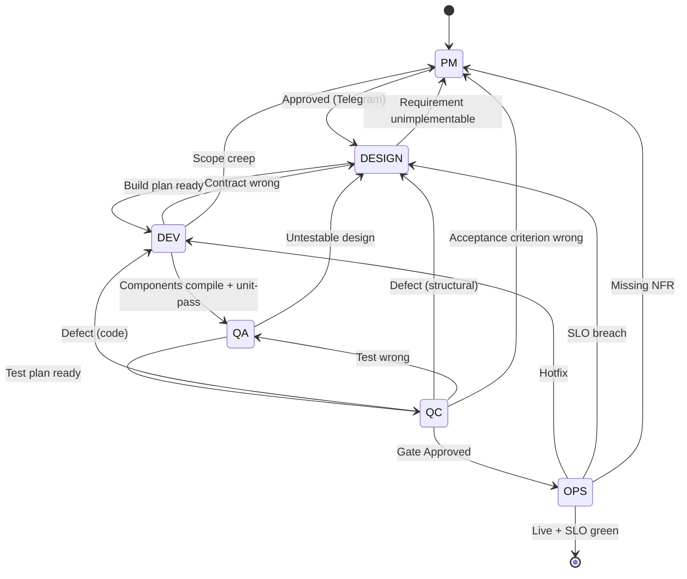
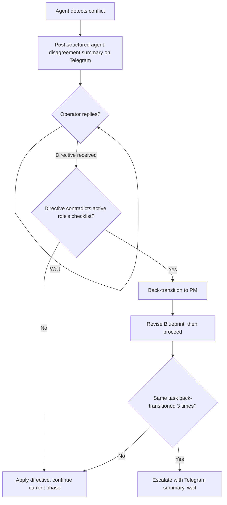

# Single-Agent Adaptation

> **Class B — Methodology adapter.** This file describes how the single-agent variant ([`variants/single-agent/`](../../variants/single-agent/)) executes the methodology in [`guideline/`](../). Read this file together with the active role guide whenever the agent's variant is single-agent.

---

## 1. Topology — One Picture

```
                          ┌──────────────────────────┐
                          │   Operator (Telegram)    │
                          └────────────┬─────────────┘
                                       │
                  ┌────────────────────▼────────────────────┐
                  │  Existing OpenClaw                       │
                  │  Agent: gateforge-single                 │
                  │  Model: anthropic/claude-sonnet-4-6      │
                  │                                          │
                  │  Workspace = ~/.openclaw/workspace       │
                  │                                          │
                  │  ┌─────────────────────────────────┐    │
                  │  │  Phase State Machine            │    │
                  │  │                                 │    │
                  │  │   PM → DESIGN → DEV → QA → QC   │    │
                  │  │                          → OPS  │    │
                  │  └─────────────────────────────────┘    │
                  └────────────────┬─────────────────────────┘
                                   │
                ┌──────────────────┼──────────────────┐
                ▼                  ▼                  ▼
        ┌─────────────┐    ┌─────────────┐    ┌─────────────┐
        │  Blueprint  │    │  Project    │    │  Deploy     │
        │  Repo (Git) │    │  Code Repo  │    │  Target     │
        │  Read+Write │    │  Read+Write │    │  (SSH)      │
        └─────────────┘    └─────────────┘    └─────────────┘
```

The single agent commits to **Blueprint** and **Code** repos directly. There is **no architect-merge gate, no HMAC callback, no cross-VM dispatch**. Phase transitions are recorded in `project/state.md`; the agent self-enforces phase-exit checklists.

For host requirements, install steps, and (optional) Tailscale-Serve setup, see [`variants/single-agent/README.md`](../../variants/single-agent/README.md).

---

## 2. Role → Identity Mapping

In single-agent, **every role guide in `guideline/roles/`** is executed by the same OpenClaw agent (`gateforge-single`). The agent role-switches by re-reading the guide and updating `project/state.md`.

| Role guide                                            | Phase     | Owning agent identity | When to read                                                |
|-------------------------------------------------------|-----------|-----------------------|-------------------------------------------------------------|
| `roles/pm/PM-GUIDE.md`                                | `PM`      | `gateforge-single`    | First phase; entered on every back-transition               |
| `roles/system-design/SYSTEM-DESIGN-GUIDE.md`          | `DESIGN`  | `gateforge-single`    | After PM `Approved`                                         |
| `roles/system-design/RESILIENCE-SECURITY-GUIDE.md`    | `DESIGN`  | `gateforge-single`    | Together with SYSTEM-DESIGN-GUIDE on every DESIGN entry     |
| `roles/development/DEVELOPMENT-GUIDE.md`              | `DEV`     | `gateforge-single`    | After DESIGN handoff                                        |
| `roles/qa/QA-FRAMEWORK.md`                            | `QA`      | `gateforge-single`    | After DEV phase exit                                        |
| `roles/qc/QC-GUIDE.md`                                | `QC`      | `gateforge-single`    | After QA phase exit; **always re-read QA-FRAMEWORK first**  |
| `roles/operations/MONITORING-OPERATIONS-GUIDE.md`     | `OPS`     | `gateforge-single`    | After QC `Approved`                                         |

> **Reading the right guide first is mandatory.** The single agent must NEVER start phase work from memory of a previous phase. Re-read the guide on every phase entry, even within the same iteration.

---

## 3. Phase Machine — States and Transitions



### Forward-transition guards

| From → To       | Hard gate                                                      | Telegram gate? |
|-----------------|----------------------------------------------------------------|----------------|
| PM → DESIGN     | User replied `Approved` to Blueprint summary                   | **Yes**        |
| DESIGN → DEV    | Build plan self-review checklist all green                     | No             |
| DEV → QA        | All components in build plan compile and pass their unit tests | No             |
| QA → QC         | Test plan self-review checklist all green                      | No             |
| QC → OPS        | Gate verdict `Approved` and Telegram `Approved` (prod only)    | **Yes (prod)** |
| OPS → done      | SLOs green for the agreed soak window                          | No             |

After **three** back-transitions targeting the same phase for the same project, the agent **must escalate** to the operator before the fourth attempt.

---

## 4. Single-Agent Translation Table

The methodology files were originally written with the multi-agent topology in mind. When you encounter the following terms, translate them as described:

| Methodology says…                              | Single-agent reads it as…                                                         |
|------------------------------------------------|-----------------------------------------------------------------------------------|
| "the System Architect (VM-1)"                  | the agent itself, currently in `PM` phase                                         |
| "the System Designer (VM-2)"                   | the agent itself, currently in `DESIGN` phase                                     |
| "the Developer (VM-3, dev-01..N)"              | the agent itself, currently in `DEV` phase                                        |
| "the QC agent (VM-4, qc-01..N)"                | the agent itself, currently in `QA` or `QC` phase                                 |
| "the Operator (VM-5)"                          | the agent itself, currently in `OPS` phase                                        |
| "dispatch to spoke" / "POST to /hooks/agent"   | transition `phase` in `project/state.md` and re-read the next guide               |
| "HMAC-signed callback"                         | `git push` of the phase deliverable; commit trailers carry the audit info         |
| "peer review by the Architect"                 | self-review pass: re-enter the role hat and run the phase-exit checklist          |
| "submission to VM-1"                           | commit and push to the Blueprint repo with the phase prefix in the subject        |
| "Architect arbitrates the conflict"            | the agent escalates on Telegram and waits for the operator's reply                |

---

## 5. Hand-off Protocol — State-Machine Transition

In multi-agent, hand-offs are **network calls + HMAC notifications**. In single-agent, hand-offs are **state-machine transitions**:

```
┌──────────────────────────────────────────────────────────────┐
│  Hand-off recipe (single-agent)                              │
│                                                               │
│  1. Update project/state.md:                                 │
│       phase: <next>                                           │
│       iteration: <i>                                          │
│       last_<prev>_commit: <sha>                               │
│                                                               │
│  2. Commit:                                                   │
│       [<NextPhase>] Begin <next> phase — <iter>               │
│       GateForge-Phase: <NextPhase>                            │
│       GateForge-Iteration: <i>                                │
│       GateForge-Status: In-Progress                           │
│       GateForge-Summary: <one-line>                           │
│                                                               │
│  3. git push                                                  │
│                                                               │
│  4. Re-read in this exact order:                             │
│       - SOUL.md                                               │
│       - guideline/adaptation/SINGLE-AGENT-ADAPTATION.md       │
│       - guideline/roles/<next-phase>/<GUIDE>.md               │
│                                                               │
│  5. Begin <next-phase> work                                   │
└──────────────────────────────────────────────────────────────┘
```

There is no `Authorization: Bearer` header, no HMAC secret, no `gf-notify-architect.service`. Commits are not signed for callback verification because there is no spoke to notify.

---

## 6. Quality-Gate Evaluation — Self-Review with Telegram Backstop

```
       Single agent
            │
            │  1. Phase work in role hat
            │
            │  2. Self-review pass
            │     — re-read role guide
            │     — re-enter the role hat
            │     — run phase-exit checklist
            │       as if reviewing a third
            │       party's work
            │
            │  3. Commit + push
            │
            ▼
   ┌─────────────────────┐
   │  Telegram operator  │  ← MANDATORY at PM exit
   │                     │     and prod OPS gate
   │  "Approved" /       │
   │  "Rework: <reason>" │
   └─────────────────────┘
```

Multi-agent gets **peer review** (the Architect re-runs the producing spoke's checklist before approving the gate). Single-agent has only **self-review**, which is structurally weaker. To compensate:

- The agent must perform self-review as a **separate sub-task with the role hat re-entered** — not in the same flow that produced the deliverable. **Re-read the guide before reviewing.**
- **Document approval requires an explicit Telegram `Approved` from the operator** before any document transitions from `In-Review` to `Approved`. This is the **single most important governance hook** in single-agent mode.
- The Telegram-approved boundary is mandatory before:
  - PM → DESIGN
  - QC → OPS (for production deploys)
  - Any guideline-pin upgrade (`Upgrade guideline to vX.Y.Z — Approved`)

Without the human-in-the-loop on document approval, single-agent quality drifts toward vibe-coding. The check is what keeps it honest.

---

## 7. Conflict Resolution



---

## 8. Single-Agent-Only Constructs

| **Exists in single-agent**                                                | **Does NOT exist in single-agent**                                       |
|---------------------------------------------------------------------------|--------------------------------------------------------------------------|
| Phase identities held by one OpenClaw agent (`gateforge-single`)          | Per-VM `OPENCLAW_TOKEN`, `${VMn_GATEWAY_TOKEN}`, `${VMn_AGENT_SECRET}`   |
| Role-switching via state-machine transitions in `project/state.md`        | `gf-notify-architect.service` (the install does not create it)           |
| Self-review (no peer review)                                              | Cross-VM `agentId` field (every dispatch is `gateforge-single`)          |
| Telegram-gated document approval as the primary quality backstop          | HMAC verification on commits                                             |
| Mandatory re-read of the role guide on every phase entry                  | Authorization: Bearer cross-VM dispatch                                  |

---

## 9. When to Migrate to Multi-Agent

Signals that you've outgrown single-agent:

- More than ~3 iterations of parallel module development needed at once.
- More than ~50 test cases per iteration (single-agent QC starts queueing real-world work).
- A regulatory audit requires explicit role separation (multi-agent provides this by VM boundary).
- Real human team members join who want their own workspaces.

Migration is straightforward because the Blueprint is unchanged. See [`variants/single-agent/docs/MIGRATION-FROM-MULTI-AGENT.md`](../../variants/single-agent/docs/MIGRATION-FROM-MULTI-AGENT.md) for the reverse direction; the forward direction follows the same recipe in mirror.
