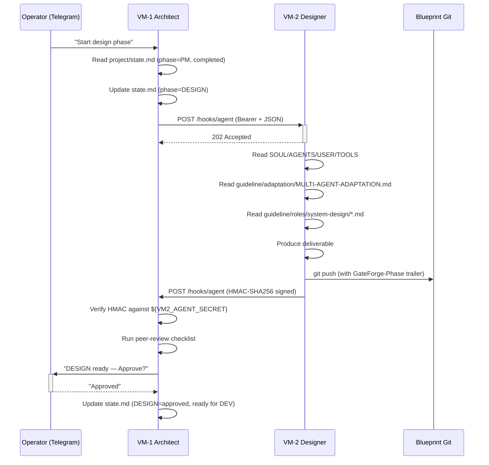

# GateForge Multi-Agent Variant

> **Five OpenClaw VMs. One Architect-led Blueprint. Cross-VM peer review at every gate.**
>
> Class A — OpenClaw runtime contract for the multi-agent topology. The methodology lives at [`../../guideline/`](../../guideline/).

---

## What Is This

The multi-agent variant runs **five OpenClaw instances** on five isolated VMs over a Tailscale mesh. The System Architect (VM-1) is the **hub**; Designer (VM-2), Developers (VM-3), QC (VM-4), and Operator (VM-5) are **spokes**. All cross-VM traffic is HTTPS to the spoke's Tailscale-MagicDNS hostname on port 18789, authenticated with `Authorization: Bearer ${VMn_GATEWAY_TOKEN}`, with results notified back to VM-1 via HMAC-SHA256-signed callbacks.

| | **Multi-agent (this variant)**           | **Single-agent ([sibling](../single-agent/))** |
|---|---|---|
| VMs | 5 | 1 |
| OpenClaw instances | 5 | 1 |
| Models | Opus 4.6 + Sonnet 4.6 + MiniMax 2.7 | Sonnet 4.6 |
| Inter-agent comms | HTTPS Bearer + HMAC notifications | None |
| Telegram | Architect (VM-1) only | Single agent |
| Quality gates | Two-pass — self + peer review | Self-review + Telegram-approved boundary |
| Setup time | ~60 min | ~5 min |

---

## Architecture

```
                          ┌──────────────────────────┐
                          │   Operator (Telegram)    │
                          └────────────┬─────────────┘
                                       │
                                       ▼
        ┌──────────────────────────────────────────────────────────────────┐
        │  VM-1  SYSTEM ARCHITECT  (HUB)                                   │
        │  Claude Opus 4.6                                                  │
        │  tonic-architect.<tailnet>.ts.net : 18789                         │
        │                                                                   │
        │  • Owns the Blueprint (writes)                                    │
        │  • Dispatches tasks to spokes                                     │
        │  • Receives HMAC-signed callbacks                                 │
        │  • Runs peer-review at every quality gate                         │
        └────┬───────────────┬───────────────┬───────────────┬──────────────┘
             │               │               │               │
             │ HTTPS+Bearer  │ HTTPS+Bearer  │ HTTPS+Bearer  │ HTTPS+Bearer
             ▼               ▼               ▼               ▼
       ┌──────────┐    ┌──────────┐    ┌──────────┐    ┌──────────┐
       │  VM-2    │    │  VM-3    │    │  VM-4    │    │  VM-5    │
       │ Designer │    │ Devs     │    │ QC pool  │    │ Operator │
       │ Sonnet   │    │ Sonnet   │    │ MiniMax  │    │ MiniMax  │
       │  4.6     │    │  4.6     │    │   2.7    │    │   2.7    │
       │          │    │ dev-01   │    │  qc-01   │    │          │
       │          │    │ dev-02   │    │  qc-02   │    │          │
       └────┬─────┘    └────┬─────┘    └────┬─────┘    └────┬─────┘
            │               │               │               │
            │  HMAC-SHA256 callback to architect on every commit
            └───────────────┴───────────────┴───────────────┘
                                  │
                                  ▼
                    ┌────────────────────────────┐
                    │  Shared Blueprint Git Repo │
                    │  Read by all VMs           │
                    │  Written by VM-1 only      │
                    └────────────────────────────┘
                                  │
                                  ▼
                    ┌────────────────────────────┐
                    │  US Deployment VM          │
                    │  tonic.<tailnet>.ts.net    │
                    │  (no OpenClaw — SSH only)  │
                    └────────────────────────────┘
```

---

## VM Assignments

| VM    | Role             | Model                       | MagicDNS host                              | Gateway | Pool size |
|-------|------------------|-----------------------------|--------------------------------------------|---------|-----------|
| VM-1  | System Architect | `anthropic/claude-opus-4-6` | `tonic-architect.<tailnet>.ts.net`         | `:18789`| 1         |
| VM-2  | System Designer  | `anthropic/claude-sonnet-4-6` | `tonic-designer.<tailnet>.ts.net`        | `:18789`| 1         |
| VM-3  | Developers       | `anthropic/claude-sonnet-4-6` | `tonic-developer.<tailnet>.ts.net`       | `:18789`| 1..N      |
| VM-4  | QC Agents (QA+QC)| `minimax/minimax-2.7`       | `tonic-qc.<tailnet>.ts.net`                | `:18789`| 1..N      |
| VM-5  | Operator         | `minimax/minimax-2.7`       | `tonic-operator.<tailnet>.ts.net`          | `:18789`| 1         |
| US VM | Deployment target| (no OpenClaw)               | `tonic.<tailnet>.ts.net`                   | N/A     | N/A       |

---

## Required Reading Order (every agent, every session)

```
   1. SOUL.md                                          ┐
   2. AGENTS.md                                        │  per-VM, this directory
   3. USER.md                                          │
   4. TOOLS.md                                         ┘
                          │
                          ▼
   5. ../../../guideline/adaptation/MULTI-AGENT-ADAPTATION.md   ┐
   6. ../../../guideline/BLUEPRINT-GUIDE.md                     │  shared methodology
   7. ../../../guideline/roles/<active-phase>/<GUIDE>.md        ┘
                          │
                          ▼
   8. project/state.md                                 ┐
   9. project/gateforge_<project_name>.md (Class C)    ┘  per-project Blueprint repo
```

If any file is missing, **stop and escalate** to the operator before proceeding.

---

## Dispatch Sequence — One Cycle



---

## Repository Layout

```
variants/multi-agent/
├── README.md                          # This file
│
├── vm-1-architect/                    ← System Architect (HUB)
│   ├── SOUL.md                        # Class A — runtime contract
│   ├── AGENTS.md                      # Agent registry, network topology
│   ├── USER.md                        # Operator context, secrets, registry
│   ├── TOOLS.md                       # Tool allowlist + sandbox mode
│   └── openclaw-config/
│       ├── openclaw.json
│       └── configure-openclaw.sh
│
├── vm-2-designer/                     ← System Designer
│   ├── SOUL.md, AGENTS.md, USER.md, TOOLS.md
│   └── openclaw-config/openclaw.json
│
├── vm-3-developers/                   ← Developer pool
│   ├── SOUL.md, AGENTS.md, USER.md, TOOLS.md
│   ├── dev-01/SOUL.md
│   ├── dev-02/SOUL.md
│   └── openclaw-config/openclaw.json
│
├── vm-4-qc-agents/                    ← QC pool (owns QA + QC phases)
│   ├── SOUL.md, AGENTS.md, USER.md, TOOLS.md
│   ├── qc-01/SOUL.md
│   ├── qc-02/SOUL.md
│   └── openclaw-config/openclaw.json
│
├── vm-5-operator/                     ← Operator
│   ├── SOUL.md, AGENTS.md, USER.md, TOOLS.md
│   └── openclaw-config/openclaw.json
│
├── install/                           ← Setup + host-side notifier
│   ├── setup-vm{1..5}-*.sh
│   ├── install-common.sh
│   ├── install-host-notifier.sh
│   ├── test-{communication,connectivity,spoke}.sh
│   ├── host-side/
│   │   ├── gf-notify-architect.{sh,service,path}
│   │   └── gf-replay-deadletter.sh
│   └── openclaw-configs/
│       ├── OPENCLAW-CONFIG-GUIDE.md
│       └── configure-openclaw-spoke.sh
│
└── docs/
    ├── INSTALL-GUIDE.md
    ├── TEST-COMMUNICATION.md
    ├── _SHARED_FILENAME_COMPLIANCE.md
    ├── _SHARED_NOTIFICATION_PROTOCOL.md
    └── _SHARED_SECRETS_SECTION.md
```

The methodology files (`BLUEPRINT-GUIDE.md`, role guides, adaptation files) live in [`../../guideline/`](../../guideline/) and are shared with the single-agent variant.

---

## Installation

### Step 1 — Clone on every VM

```bash
git clone https://github.com/tonylnng/gateforge-openclaw-guideline.git
cd gateforge-openclaw-guideline/variants/multi-agent
```

### Step 2 — Run the setup script for each VM's role

```bash
sudo install/setup-vm1-architect.sh    # on VM-1
sudo install/setup-vm2-designer.sh     # on VM-2
sudo install/setup-vm3-developers.sh   # on VM-3
sudo install/setup-vm4-qc-agents.sh    # on VM-4
sudo install/setup-vm5-operator.sh     # on VM-5
```

Each script:
- Installs Tailscale and joins the tailnet
- Provisions the Bearer token and Agent secret in `/opt/secrets/gateforge.env`
- Wires the host-side `gf-notify-architect.service` (spokes only)
- Configures OpenClaw with the right SOUL/AGENTS/USER/TOOLS workspace path

### Step 3 — Verify connectivity

```bash
install/test-connectivity.sh        # all VMs reachable on :18789
install/test-communication.sh       # full hub→spoke→hub round-trip
```

### Step 4 — Pin guideline SHA in your project

```yaml
# In <project>-blueprint/project/state.md
guideline_repo: tonylnng/gateforge-openclaw-guideline
guideline_version: 2.0.0
guideline_commit: <40-char SHA>
```

The agent re-reads from this **pinned SHA** for the project's life. Upgrades require an explicit Telegram-approved boundary (`Upgrade guideline to v2.x.y — Approved`).

---

## Quality Gates — Two-Pass Review

```
                    Producing spoke (VM-2..VM-5)
                              │
                              │  1. Self-review (spoke runs its
                              │     own phase-exit checklist)
                              │  2. Commits with checklist results
                              │     in commit body
                              ▼
                   ┌─────────────────────┐
                   │  Blueprint Git push │
                   └──────────┬──────────┘
                              │  HMAC callback
                              ▼
                         VM-1 Architect
                              │
                              │  3. Peer-review (Architect re-runs
                              │     same checklist on committed work)
                              │  4. Verdict: Approved / Rework
                              ▼
                    ┌────────────────────┐
                    │  Telegram operator │  ← only if PM exit or prod OPS gate
                    └────────────────────┘
```

This **two-pass review** is the structural advantage of multi-agent over single-agent.

---

## Migration from `gateforge-openclaw-configs` (legacy repo)

The legacy repo `tonylnng/gateforge-openclaw-configs` was archived at v2.0.0. Migration:

```
   ┌─────────────────────────────────┐
   │  On each VM:                    │
   │                                 │
   │  cd /opt                        │
   │  sudo rm -rf  gateforge-openclaw-configs
   │  sudo git clone <new-repo>      │
   │  cd <new-repo>/variants/multi-agent
   │                                 │
   │  Update openclaw.json workspace │
   │  path → variants/multi-agent/   │
   │           vm-N-<role>/          │
   │                                 │
   │  systemctl restart openclaw     │
   └─────────────────────────────────┘
                  │
                  ▼
   ┌─────────────────────────────────┐
   │  In each project's Blueprint:   │
   │                                 │
   │  Update project/state.md:       │
   │    guideline_repo: <new-repo>   │
   │    guideline_version: 2.0.0     │
   │    guideline_commit: <sha>      │
   │                                 │
   │  Commit with [Ops] phase prefix │
   └─────────────────────────────────┘
                  │
                  ▼
       Run install/test-communication.sh
       to confirm cross-VM dispatch still works
```
