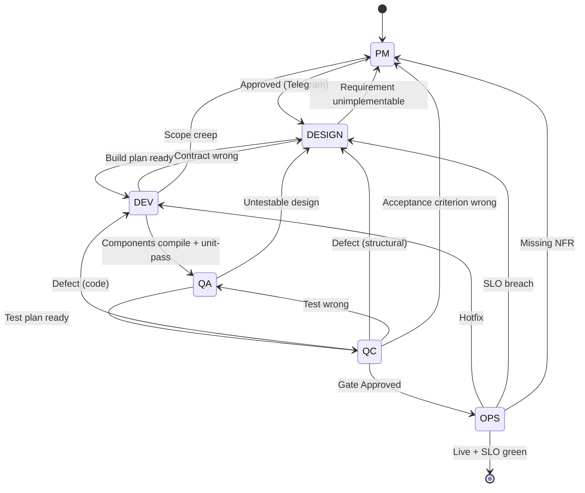

# GateForge Single-Agent Variant

> **One OpenClaw. One agent. The full software development lifecycle.**
>
> Class A — OpenClaw runtime contract for the single-agent topology. The methodology lives at [`../../guideline/`](../../guideline/).

---

## What Is This

The single-agent variant runs **one OpenClaw instance** on one VM. The same agent assumes the **PM, DESIGN, DEV, QA, QC, and OPS** roles in sequence by reading the matching guide on each phase entry. The active phase is recorded in the Blueprint's `project/state.md`; the agent re-reads it at every session start so role-switching is deterministic, not memory-based.

| | **Single-agent (this variant)** | **Multi-agent ([sibling](../multi-agent/))** |
|---|---|---|
| VMs | 1 | 5 |
| OpenClaw instances | 1 | 5 |
| Models | Sonnet 4.6 (default) | Opus 4.6 + Sonnet 4.6 + MiniMax 2.7 |
| Inter-agent comms | None — internal phase transitions | HTTPS Bearer + HMAC notifications |
| Telegram | Single agent | Architect (VM-1) only |
| Quality gates | Self-review + Telegram-approved boundary | Two-pass — self + peer review |
| Setup time | ~5 min (manual copy) | ~60 min |
| Best for | Solo / small-team, prototypes, internal tools | Multi-team, parallel work, audit-heavy |

---

## Architecture

```
                          ┌──────────────────────────┐
                          │   Operator (Telegram)    │
                          └────────────┬─────────────┘
                                       │
                  ┌────────────────────▼────────────────────┐
                  │  Existing OpenClaw                       │
                  │  Agent: gateforge-single                 │
                  │  Model: anthropic/claude-sonnet-4-6      │
                  │                                          │
                  │  Workspace = ~/.openclaw/workspace       │
                  │                                          │
                  │  ┌─────────────────────────────────┐    │
                  │  │  Phase State Machine            │    │
                  │  │                                 │    │
                  │  │   PM → DESIGN → DEV → QA → QC   │    │
                  │  │                          → OPS  │    │
                  │  └─────────────────────────────────┘    │
                  └────────────────┬─────────────────────────┘
                                   │
                ┌──────────────────┼──────────────────┐
                ▼                  ▼                  ▼
        ┌─────────────┐    ┌─────────────┐    ┌─────────────┐
        │  Blueprint  │    │  Project    │    │  Deploy     │
        │  Repo (Git) │    │  Code Repo  │    │  Target     │
        │  Read+Write │    │  Read+Write │    │  (SSH)      │
        └─────────────┘    └─────────────┘    └─────────────┘
```

The agent commits to **Blueprint** and **Code** repos directly. There's no architect-merge gate, no HMAC callbacks, no cross-VM dispatch. Phase transitions are recorded in `project/state.md`; the agent self-enforces phase-exit checklists.

---

## Phase Machine

The Single Agentic SDLC is a state machine. The single OpenClaw agent occupies exactly one state (the **phase**) at a time and role-switches by re-loading the corresponding role guide before continuing.

### States

| Phase   | Role guide (Class B)                                                                      | Primary output                              |
|---------|-------------------------------------------------------------------------------------------|---------------------------------------------|
| `PM`    | `../../guideline/roles/pm/PM-GUIDE.md`                                                    | `project/blueprint/**`                      |
| `DESIGN`| `../../guideline/roles/system-design/SYSTEM-DESIGN-GUIDE.md` + `RESILIENCE-SECURITY-GUIDE.md` | `project/design/**`                       |
| `DEV`   | `../../guideline/roles/development/DEVELOPMENT-GUIDE.md`                                  | source code + `project/dev/**` notes        |
| `QA`    | `../../guideline/roles/qa/QA-FRAMEWORK.md`                                                | `project/qa/test-plan.md`                   |
| `QC`    | `../../guideline/roles/qc/QC-GUIDE.md`                                                    | `project/qc/test-runs/**` + gate verdict    |
| `OPS`   | `../../guideline/roles/operations/MONITORING-OPERATIONS-GUIDE.md`                         | deploy logs + SLO dashboards                |

### Transitions



### Forward-transition guards

| From → To       | Hard gate                                                      | Telegram gate? |
|-----------------|----------------------------------------------------------------|----------------|
| PM → DESIGN     | User replied `Approved` to Blueprint summary                   | **Yes**        |
| DESIGN → DEV    | Build plan self-review checklist all green                     | No             |
| DEV → QA        | All components in build plan compile and pass their unit tests | No             |
| QA → QC         | Test plan self-review checklist all green                      | No             |
| QC → OPS        | Gate verdict `Approved` and Telegram `Approved` (prod only)    | **Yes (prod)** |
| OPS → done      | SLOs green for the agreed soak window                          | No             |

After **three** back-transitions targeting the same phase for the same project, the agent **must escalate** to the operator before the fourth attempt.

---

## Required Reading Order (every session)

```
   1. agent-workspace/SOUL.md                          ┐
   2. agent-workspace/AGENTS.md                        │  this directory
   3. agent-workspace/USER.md                          │
   4. agent-workspace/TOOLS.md                         ┘
                          │
                          ▼
   5. ../../guideline/adaptation/SINGLE-AGENT-ADAPTATION.md   ┐
   6. ../../guideline/BLUEPRINT-GUIDE.md                      │  shared methodology
   7. ../../guideline/roles/<active-phase>/<GUIDE>.md         ┘
                          │
                          ▼
   8. project/state.md                                 ┐
   9. project/gateforge_<project_name>.md (Class C)    ┘  per-project Blueprint repo
```

Steps 5–7 are mandatory **on every phase entry**. Single-agent quality depends on re-reading the role guide rather than working from memory of a previous phase.

---

## Repository Layout

```
variants/single-agent/
│
├── README.md                          # This file
│
├── agent-workspace/                   ← Copy this whole folder into OpenClaw's workspace
│   ├── SOUL.md                        # Class A — persona + phase machine
│   ├── AGENTS.md                      # Class A — single-agent registry
│   ├── USER.md                        # Class A — operator context, channels, secrets
│   └── TOOLS.md                       # Class A — tool allowlist + env-var table
│
├── install/                           # Currently empty — manual copy is the install
│
└── docs/
    ├── COMPARISON-VS-MULTI-AGENT.md
    └── MIGRATION-FROM-MULTI-AGENT.md
```

The methodology files (`BLUEPRINT-GUIDE.md`, role guides, adaptation files) live in [`../../guideline/`](../../guideline/) and are shared with the multi-agent variant.

---

## Installation — Manual Copy

This variant is **manual copy-and-go**. No setup scripts.

### Step 1 — Clone this repo on the VM that runs OpenClaw

```bash
git clone https://github.com/tonylnng/gateforge-openclaw-guideline.git
cd gateforge-openclaw-guideline/variants/single-agent
```

### Step 2 — Copy the agent workspace into OpenClaw

```
   gateforge-openclaw-guideline/                  ~/.openclaw/workspace/
   variants/single-agent/                              │
   └── agent-workspace/                                │
       ├── SOUL.md     ────────────────────────▶  ├── SOUL.md
       ├── AGENTS.md   ────────────────────────▶  ├── AGENTS.md
       ├── USER.md     ────────────────────────▶  ├── USER.md
       └── TOOLS.md    ────────────────────────▶  └── TOOLS.md
```

```bash
cp -r agent-workspace/. ~/.openclaw/workspace/
```

### Step 3 — Configure OpenClaw

In your OpenClaw configuration:

- **Sandbox mode:** `all` (Docker-backed; the same agent runs code in DEV/QC phases)
- **Agent ID:** `gateforge-single`
- **Default model:** `anthropic/claude-sonnet-4-6`
- **Workspace path:** the directory you copied `agent-workspace/*` into
- **Hook token + Telegram bot token:** from your secrets store

See `agent-workspace/TOOLS.md` and `agent-workspace/USER.md` for the full env-var list.

### Step 4 — Place secrets

```
   ┌─────────────────────────────────────────────────────────────┐
   │  /opt/secrets/gateforge.env                  root:root 0600 │
   │    OPENCLAW_TOKEN=…                                          │
   │    GF_HOOK_TOKEN=…                                           │
   │                                                              │
   │  ~/.config/gateforge/github-tokens.env       user 0600       │
   │    GH_PAT=ghp_…                                              │
   │                                                              │
   │  ~/.config/gateforge/anthropic.env           user 0600       │
   │    ANTHROPIC_API_KEY=sk-ant-…                                │
   │                                                              │
   │  ~/.config/gateforge/telegram.env            user 0600       │
   │    TELEGRAM_BOT_TOKEN=…                                      │
   │    TELEGRAM_CHAT_ID=…                                        │
   └─────────────────────────────────────────────────────────────┘
```

### Step 5 — Pin guideline SHA in your project

```yaml
# In <project>-blueprint/project/state.md
guideline_repo: tonylnng/gateforge-openclaw-guideline
guideline_version: 2.0.0
guideline_commit: <40-char SHA>
```

The agent re-reads from this **pinned SHA** for the project's life. Upgrades require an explicit Telegram-approved boundary.

### Step 6 — Restart OpenClaw and verify

The agent should boot, read `SOUL.md`, then descend through the reading-order list above. If it stops with a "missing file" error, check the relative paths to `../../guideline/...` resolve from the workspace.

---

## Quality Gates — Self-Review + Telegram Backstop

```
       Single agent
            │
            │  1. Phase work in role hat
            │
            │  2. Self-review pass
            │     — re-read role guide
            │     — re-enter the role hat
            │     — run phase-exit checklist
            │       as if reviewing a third
            │       party's work
            │
            │  3. Commit + push
            │
            ▼
   ┌─────────────────────┐
   │  Telegram operator  │  ← MANDATORY at PM exit
   │                     │     and prod OPS gate
   │  "Approved" /       │
   │  "Rework: <reason>" │
   └─────────────────────┘
```

Multi-agent gets **peer review** (the Architect re-runs the producing spoke's checklist before approving the gate). Single-agent has only **self-review**, which is structurally weaker. The **Telegram-approved boundary** is the human-in-the-loop that keeps quality honest.

---

## Bootstrapping a New Project

```mermaid
flowchart LR
    A[Operator: 'start project acme_billing'] --> B[Agent validates name<br/>regex: ^[a-z][a-z0-9_]{2,40}$]
    B --> C[Agent runs<br/>tools/bootstrap-project.sh]
    C --> D[Creates project/<br/>gateforge_acme_billing.md<br/>from template]
    D --> E[Agent records pin in<br/>project/state.md:<br/>guideline_repo, version, commit]
    E --> F[Agent enters PM phase,<br/>reads guideline/roles/pm/PM-GUIDE.md]
    F --> G[Discovery Q&A on Telegram]
```

---

## Migration from `gateforge-openclaw-single` (legacy repo)

The legacy repo `tonylnng/gateforge-openclaw-single` was archived at v2.0.0. Migration:

```
   ┌──────────────────────────────────┐
   │  On the VM running OpenClaw:     │
   │                                  │
   │  cd ~                            │
   │  rm -rf gateforge-openclaw-single│
   │  git clone <new-repo>            │
   │  cd <new-repo>/variants/         │
   │      single-agent                │
   │                                  │
   │  cp -r agent-workspace/.         │
   │     ~/.openclaw/workspace/       │
   │                                  │
   │  Restart OpenClaw                │
   └──────────────────────────────────┘
                  │
                  ▼
   ┌──────────────────────────────────┐
   │  In each project's Blueprint:    │
   │                                  │
   │  Update project/state.md:        │
   │    guideline_repo: <new-repo>    │
   │    guideline_version: 2.0.0      │
   │    guideline_commit: <sha>       │
   │                                  │
   │  Commit with [Ops] phase prefix  │
   └──────────────────────────────────┘
                  │
                  ▼
   ┌──────────────────────────────────┐
   │  Run a read-only audit pass      │
   │  before resuming phase work      │
   │  (see docs/MIGRATION-FROM-       │
   │   MULTI-AGENT.md for the         │
   │   audit checklist)               │
   └──────────────────────────────────┘
```
